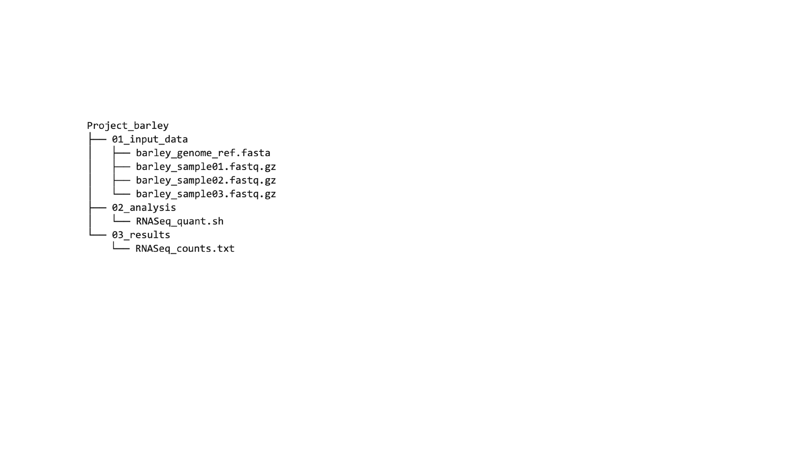
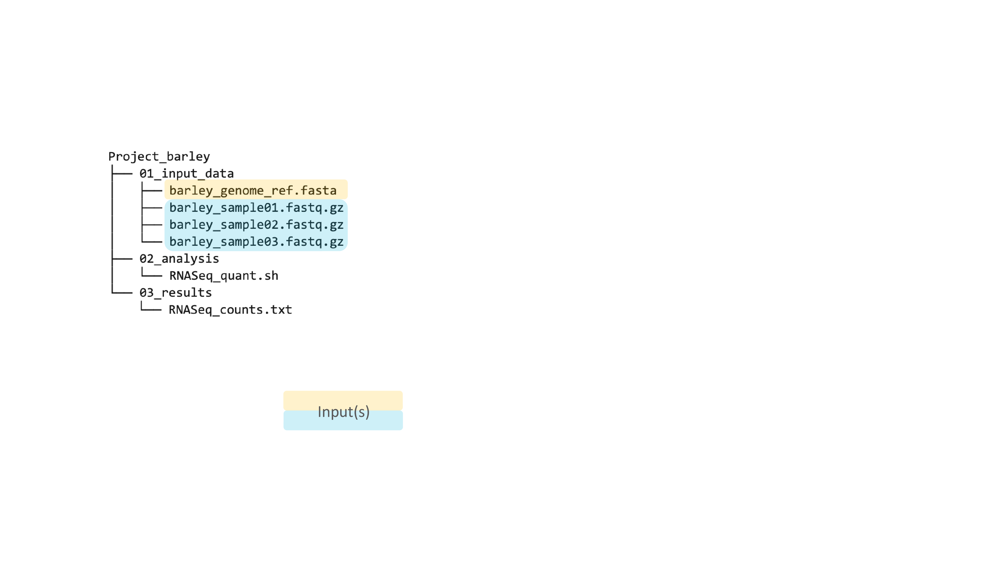
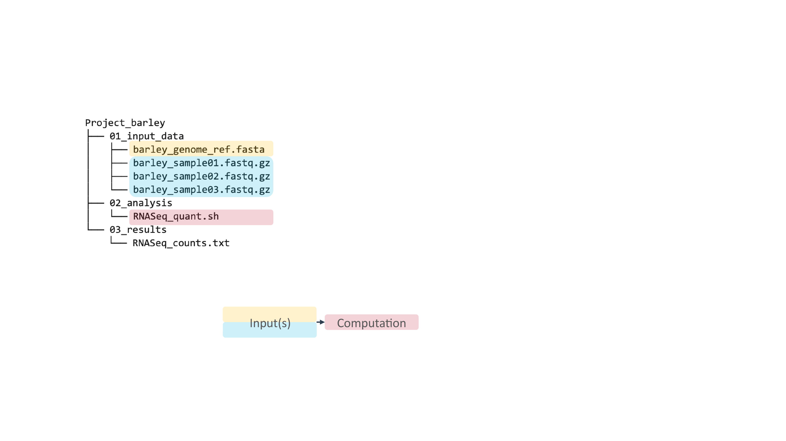
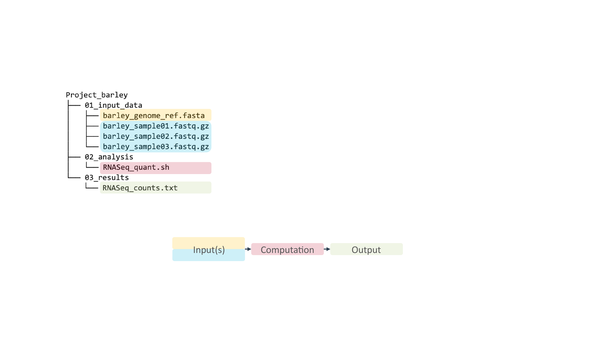
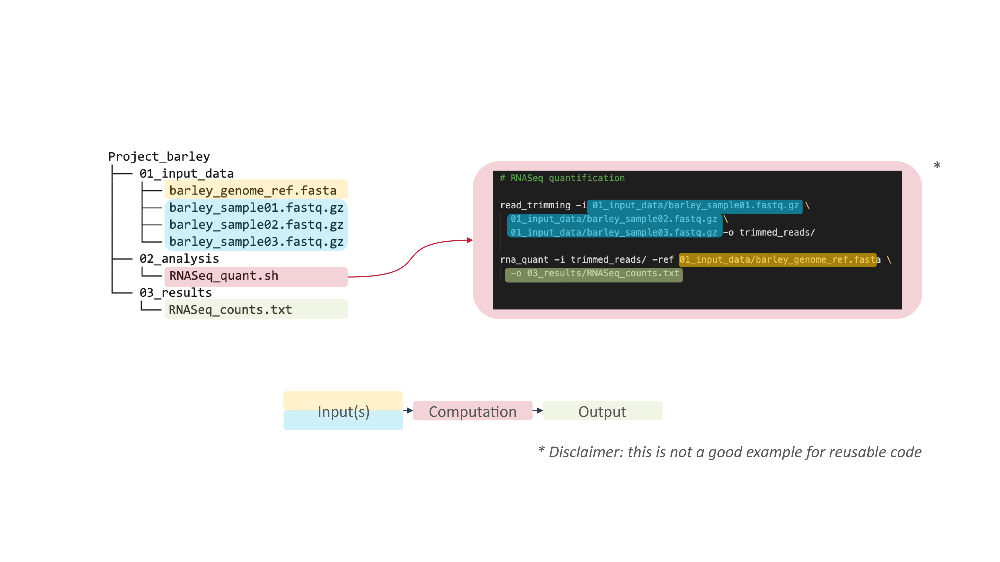
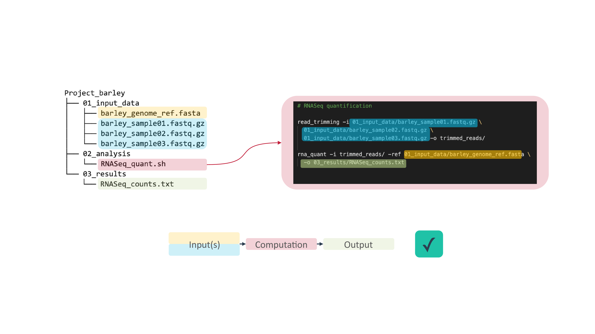
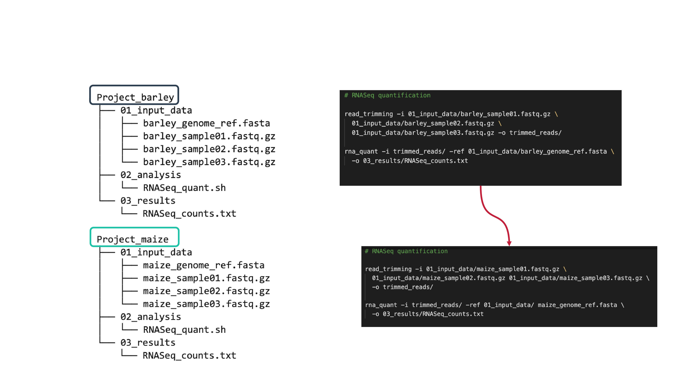
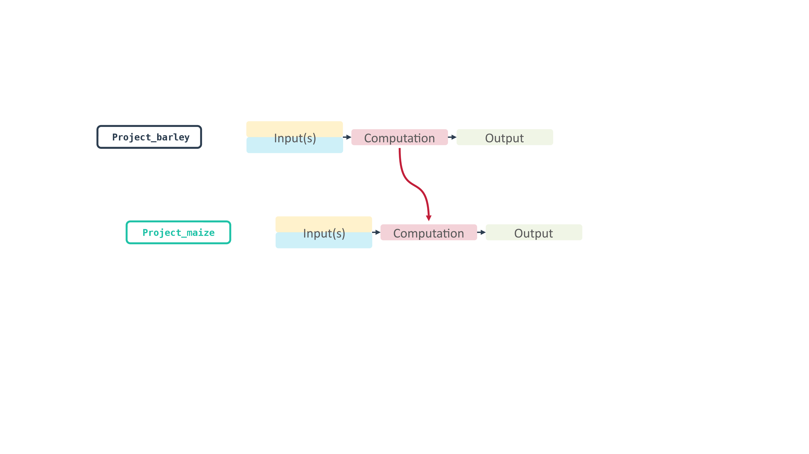
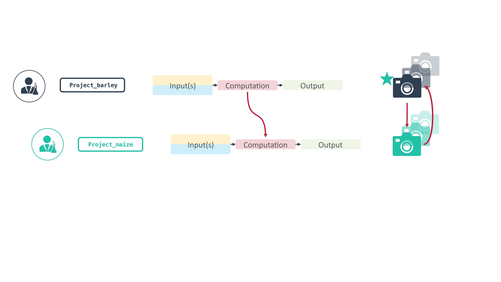

# Data Storage and Versioning

---

# Data stores

---

# Backup vs. Archive

|           | Backup              | Archive                       |
|--------------|---------------------|-------------------------------|
| Storage type | Short-, mid-term    | Long-term                     |
| Purpose      | Disaster recovery   | Long-term storage, compliance |
| Reason       | Duplication         | Migration                     |
| Usage        | Work in progress    | Cold, Unused data             |
| Changes      | Short-term updates  | No updates                    |
| Trend        | Cyclic, Replacement | Growing                       |
| Latency      | Short/Costly        | High/Cheaper                  |

---

# 3-2-1 backup rule

---

# Version control and track changes

It’s good practice to document:

- What was changed?
- Who is responsible?
- When did it happen?
- Why the changes?

---

# Types of Version Control

- by file name (_v1, _v2)
- cloud services
  - dropbox, icloud, gdrive
- distributed version control system
  - e.g. Git

---

# Which files need to be "versioned"? :pencil: 

- paper manuscript (.docx)
- single-cell RNASeq reads (.fastq.gz)
- spread sheet with photometer measurements (.xlsx)
- calendar invitation (.ical)
- photo of SDS-PAGE (.jpeg)
- excel workbook with calculations (.xlsx)
- presentation for a conference (.pdf)
- data analysis script (.py)

<!--

## No versioning

- "Raw data" or "original data" > backup and do not touch
- do not calculate anything in measurement excel workbooks

## Versioning

anything that is (frequently) updated
- manuscripts
- calculations
- workflows
- scripts

## Does not matter

things you use and ignore
- calendar invitations

-->

---

# Concept of Git and git-based platforms

---

# Cloud Services

✓ Documents  
✓ Small data  
✓ Presentations  

X  Code  
X  Data analytical projects  
X  Big (“raw”) data  

---

# Git and git platforms

∼ Documents
✓ Small data  
∼ Presentations

✓✓ Code
✓✓ Data analytical projects
∼ Big (“raw”) data

---

# Why git? ≈> Why code?

- Save time
- Avoid doing repetitive tasks “by hand”
- Reuse scripts, analyses, pipelines
- Reproduce results

---

# A simple example: RNASeq project

---

# A simple example: RNASeq project

---

# A simple example: RNASeq project

---

# A simple example: RNASeq project

---

# A simple example: RNASeq project

---

# Take snapshots of your code work…

(... as long as it works)

---

# Take snapshots of your code work…

(... as long as it works)

---

# Scenario 1: More data

---

# Scenario 1: More data

---

# Scenario 1: More data

---

# Let git track changes and keep things clean

---

# Scenario 2: Pipeline breaks

---

# Revert to snapshot

---

# Scenario 3: New project, same type of data and analysis

---

# Scenario 3: New project, same type of data and analysis

---

# Re-use code

---

# Re-use code

---

# Re-use code – People have done this

---

# Re-use code – People have done this

---

# Re-use code – Link and contribute

---

# Git: summary

- Version control system
- Git “repository” = a central data package (directory)
- Allows to track changes to any file in the repository
  - **What** was changed
  - **When** was it changed
  - By **whom** was it changed
  - **Why** was it changed?

---

# GitHub and GitLab

- A well-documented cloud environment
- Active syncing
- Not automatically synced
- Non-automated version control
- You have the control what changes to track and what to sync
- Time machine to go back to older versions

---

# GitHub and Gitlab team projects

Simplifies concurrent work & merging changes

- Online service to host our projects
- Share code with other developers
- Others can download our projects, work on and contribute to them
- They can upload their changes and merge them with the main project

---

# Cloud vs. Git

--- 

--- 

# Contributors

Slides presented here include contributions by

- name: Dominik Brilhaus
  github: https://github.com/brilator
  orcid: https://orcid.org/0000-0001-9021-3197
- name: Hajira Jabeen
  github: https://github.com/HajiraJabeen
  orcid: https://orcid.org/0000-0003-1476-2121