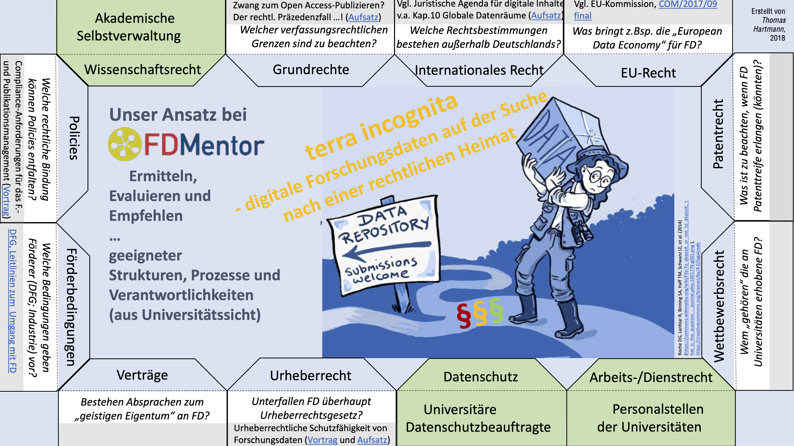
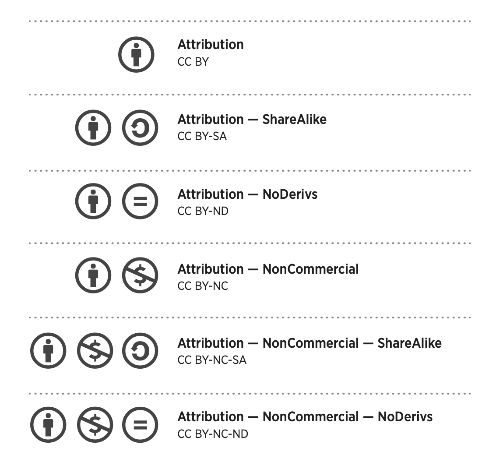
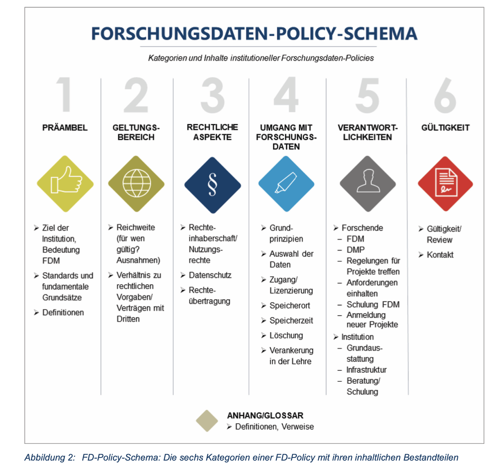

# Legal aspects of RDM

---

# Different laws touched by RDM

Hartmann, Thomas. (2019). Rechtsfragen: Institutioneller Rahmen und Handlungsoptionen für universitäres FDM. Zenodo. https://doi.org/10.5281/zenodo.2654306

---

# Open Access (OA) categories

- Gold: Published in an open-access journal that is indexed by the [DOAJ](https://doaj.org).
- Green: Toll-access on the publisher page, but there is a free copy in an OA repository.
- Hybrid: Free under an open license in a toll-access journal.
- Bronze: Free to read on the publisher page, but without a clearly identifiable license.
- Closed: All other articles, including those shared only on an Academic Social Network or in Sci-Hub.

Piwowar H et al. (2018), PeerJ https://doi.org/10.7717/peerj.4375

---

# Open Science is more than Open Access

Okafor et al. (2022) https://doi.org/10.3389/frma.2022.855198, Figure 1

---

# Creative commons

Check out: https://creativecommons.org/about/cclicenses/

adapted from https://wiki.creativecommons.org/images/0/01/6licenses-folded.pdf

---

# Data protection

[GDPR](https://gdpr-info.eu/): General Data Protection Regulation
[DS-GVO](https://www.datenschutz-wiki.de/Datenschutz-Grundverordnung) (german): Datenschutz-Grundverordnung

---

# Use of biological materials

- MTA: material transfer agreement
- Nagoya Protocol: https://www.cbd.int/abs/about/
- DSI: [Digital sequence information](https://www.genres.de/en/access-and-benefit-sharing/digital-sequence-information)

---

# FAIR and CARE

https://www.gida-global.org/care

---

# CARE principles

https://datascience.codata.org/articles/10.5334/dsj-2020-043/

---

# Research Data policies

Hiemenz, Bea & Kuberek, Monika (2018) http://dx.doi.org/10.14279/depositonce-7521

---

# CEPLAS relevant data handling guidelines & policies

- [Deutsche Forschungsgemeinschaft (2015): DFG Guidelines on the Handling of Research Data](https://www.dfg.de/en/research_funding/proposal_review_decision/applicants/research_data/)
- [Amtliche Mitteilungen der Universität zu Köln AM 07/2018: Leitlinie zum Umgang mit Forschungsdaten](https://am.uni-koeln.de/e21463/am_mitteilungen/@6/AM_2018-07_Leitlinie-zum-Umgang-mit-Forschungsdaten_ger.pdf)
- [Amtliche Bekanntmachung der Heinrich-Heine-Universität Nr. 43/2022: Forschungsdaten-Richtlinie](https://www.fdm.hhu.de/fileadmin/redaktion/Forschungsdatenmanagement/2022_Forschungsdaten-Richtlinie.pdf) 
- [Leitlinie zum Umgang mit Forschungsdaten im Forschungszentrum Jülich 05/2019](https://www.fz-juelich.de/SharedDocs/Downloads/ZB/DE/Forschungsdaten/fdm_leitlinie_forschungsdaten_fzj.pdf)
- [Senat der Max-Planck-Gesellschaft (2009): Regeln zur Sicherung guter wissenschaftlicher Praxis](https://www.mpg.de/199493/regelnWissPraxis.pdf)

---

# The Data Management Plan (DMP)

- Covers the full research data lifecycle
- Frequently updated as your project develops
- Required to different extents by funding agencies (e.g. DFG, Horizon Europe, BMBF, BMEL, ... )

---

# DMP tools

- Data Stewardship Wizard https://ds-wizard.org/
- RDMO https://rdmorganiser.github.io/ (e.g. https://rdmo.hhu.de)
- Dataplan: https://dmpg.nfdi4plants.org

> Check out the [Elixir RDMkit](https://rdmkit.elixir-europe.org/data_management_plan) for more

---

---

# Contributors

Slides presented here include contributions by

- name: Dominik Brilhaus
  github: https://github.com/brilator
  orcid: https://orcid.org/0000-0001-9021-3197
- name: Hajira Jabeen
  github: https://github.com/HajiraJabeen
  orcid: https://orcid.org/0000-0003-1476-2121