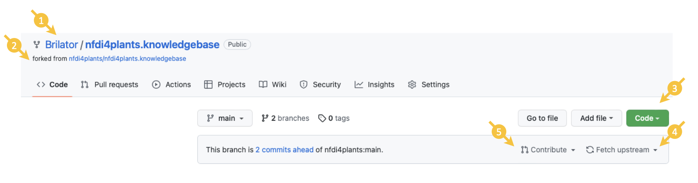

# Data Steward Circle

<style scoped>

h1, p{
    color: white;
    text-align:center;
    /* font-variant: small-caps; */
    font-size: 50px
} 

</style>


Contribution to DataPLANT
July 25th, 2023

Dominik Brilhaus

---

# Knowledge Base

Create, share, reuse, collaborate on
- articles
- guides
- images
- slides
- ...

DataPLANT Knowledge Base: https://nfdi4plants.org/nfdi4plants.knowledgebase/

---

# Content

- How to contribute to the DataPLANT [Knowledge Base](https://nfdi4plants.org/nfdi4plants.knowledgebase/)
- ... and DataPLANT [projects](https://github.com/nfdi4plants) in general

---

# Resources

Contents shown here are (in part) already somewhere in the [Knowledge Base](https://nfdi4plants.org/nfdi4plants.knowledgebase/) or at least in the [GitHub repo](https://github.com/nfdi4plants/nfdi4plants.knowledgebase). However, :warning: Links there are somewhat volatile :warning:

- [Contribution Guide](https://nfdi4plants.org/nfdi4plants.knowledgebase/docs/CONTRIBUTING.html)
- [Markdown tutorial](https://nfdi4plants.org/nfdi4plants.knowledgebase/docs/guides/tutorial_IntroductionToMarkdown.html)
- [Marp slide decks](https://nfdi4plants.org/nfdi4plants.knowledgebase/docs/guides/contribute_slide-decks.html)

---

# Part 1: Setup

--- 

# Required

:ballot_box_with_check: a [GitHub](https://github.com) account
:ballot_box_with_check: [Git](https://git-scm.com) installed and configured

--- 

# Recommended software

:ballot_box_with_check: [GitHub Desktop](https://desktop.github.com)
  - git synchronization
  - pull requests
  - manage (local and remote) branches

:ballot_box_with_check: [Visual Studio Code](https://code.visualstudio.com/)
  - all-in-one: text editor + file explorer + command line + git + ...
  - code highlighting and linting
  - many extensions available

--- 

# Recommended VS code extensions for markdown <!-- fit -->

- [Markdown all in one](https://marketplace.visualstudio.com/items?itemName=yzhang.markdown-all-in-one)
  - Creating a TOC, use of shortcuts, creating a table, copy/pasting a table from excel
- [markdownlint](https://marketplace.visualstudio.com/items?itemName=DavidAnson.vscode-markdownlint)
  - markdown linting and style checking
  - Structuring and formatting
- [Code Spell Checker](https://marketplace.visualstudio.com/items?itemName=streetsidesoftware.code-spell-checker)
  - basic spell checker that works well with code and documents
- [Markdown Shortcuts](https://marketplace.visualstudio.com/items?itemName=mdickin.markdown-shortcuts)
- [Markdown PDF](https://marketplace.visualstudio.com/items?itemName=yzane.markdown-pdf)
  - Converting a markdown to PDF
  - :bulb: this does not follow any style / layout, e.g. linked in the YAML heading

---

# Creating markdown slides in VS code: marp

[Marp for VS Code](https://marketplace.visualstudio.com/items?itemName=marp-team.marp-vscode)

---

# Part 2: Basics

--- 

# Markdown

- general idea: WYSIWYG
- add YAML metadata

:bulb: See the [Markdown tutorial](https://nfdi4plants.org/nfdi4plants.knowledgebase/docs/guides/tutorial_IntroductionToMarkdown.html) and references therein

---

# Markdown Slides (with Marp)

- add `marp: true` to YAML metadata

:bulb: See the [Marp slide decks tutorial](https://nfdi4plants.org/nfdi4plants.knowledgebase/docs/guides/contribute_slide-decks.html)


---

# GitHub

The DataPLANT GitHub organization (https://github.com/nfdi4plants) and repositories are the place where most of the magic (tool development) happens. 

:bulb: Most repositories are **public** and open for (user) feedback

---

# Issues

- Project-related task (lists)
- Communicate needs
- Example: [Swate issues](https://github.com/nfdi4plants/Swate/issues)

:bulb: See also: https://docs.github.com/en/issues/tracking-your-work-with-issues/quickstart

---

# 👩‍💻 Exercise: Open a GitHub issue

1. Navigate to the [Knowledge Base](https://github.com/nfdi4plants/nfdi4plants.knowledgebase) or another DataPLANT repo
2. Raise an issue, e.g.
   1. raise a question
   1. report a bug
   2. request a feature

---

# Forks and pull requests (PR)

- Fork = same project, different place
- Good routine to propose changes (contribute)
- [Knowledge Base Forks](https://github.com/nfdi4plants/nfdi4plants.knowledgebase/forks)

:bulb: See also: https://docs.github.com/en/get-started/quickstart/fork-a-repo

---

# 👩‍💻 Exercise: Fork and clone a GitHub repo

1. Navigate to the [Knowledge Base](https://github.com/nfdi4plants/nfdi4plants.knowledgebase) 
2. Fork the repo (i.e. create a copy under your user name)
3. Clone your fork locally (to your machine)



---

# 👩‍💻 Exercise: Create a new article (markdown)

1. Open your local "Knowledge Base" clone (File explorer or VS Code)
2. In `src/docs/_ignored`, create a new text file `<YourInitials>_dsc.md`
3. Add the following YAML header: 

```yaml
---
layout: docs
title: <YourTitle>
author: <YourName>
date: 2023-07-25
---
```

4. add some text below the YAML header

---

# 👩‍💻 Exercise: Open a pull request

1. Save your local changes
2. Sync to your fork
   1. via command line (add, commit, push) ***or***
   2. via VS Code ***or***
   3. via GitHub Desktop
3. Contribute / open a PR (follow instructions on GitHub)


---

# Part 3: The Knowledge Base

---

## Required software

:ballot_box_with_check: [Node.JS](https://nodejs.org/)  
:ballot_box_with_check: [.NET](https://dotnet.microsoft.com/en-us/download)

&emsp; :bulb: Both required for local testing of [Knowledge Base](https://nfdi4plants.org/nfdi4plants.knowledgebase/)

---

## Knowledge Base backend: Fornax


:bulb: See [nfdi4plants web components docs](https://nfdi4plants.github.io/web-components-docs/docs/SupportedStaticSiteGenerators.html#fornax)

---

## Setup

1. Clone the repo.
2. Run `dotnet tool restore` in root directory.
3. Run `dotnet paket install` in root directory.
4. Run `npm install` in root directory.

:bulb: This needs to be done only once after cloning the repo.

---

## Knowledge base local test

1. Run `npm run fornax`.
2. Open the page in your browser [http://127.0.0.1:8080/](http://127.0.0.1:8080/).

--- 


## Let's have a look at your articles (pull-requests)


---

## Markdown syntax

<style scoped>
.row {
  display: flex;
}

.column {
  /* flex: 50%; */
  padding: 10px;
}
</style>


<div class="row">
  
<div class="column" style="font-size:17px; width:800px">

- **MUST** start and end with `---` .
- **MUST** contain `layout: docs`.
    - This triggers fornax parsing to html.
- **MUST** contain `title: xxxx`.
    - added as "# xxxx" to the html
    - used to name the generated webpage.
- **MUST** contain `date: yyyy-MM-dd`
- MAY contain author: xxxx.
- MAY contain `add toc: true`.
    - If true, adds automated table of contents from all found headers in content.
- MAY contain `add support: true`.
    - If true adds DataPlant support component at the bottom.
- MAY contain `add sidebar: relative/path/to/sidebar.md` to add the sidebar element to the page.
- MAY contain any other metadata. The information will be read but will not affect the generated html.
- Keys (`layout`, `author`, etc.) are NOT case sensitive.
- Fields MAY be in any order.

</div>

<div class="column" style="width:500px">

```yaml
---
layout: docs
title: Metadata
date: 2022-05-09
author: FirstName LastName
add toc: true
add sidebar: _sidebars/mainSidebar.md
---
```

  :bulb: For details, check
  - [contribution guide](https://nfdi4plants.org/nfdi4plants.knowledgebase/docs/CONTRIBUTING.html) and 
  - [nfdi4plants web components docs](https://nfdi4plants.github.io/web-components-docs/docs/SupportedStaticSiteGenerators.html#fornax)

  </div>

</div>

---

## Slide decks &ndash; work in progress :construction: 

- Fornax currently does not auto-convert `marp.md` to `marp.html`
- Slides are mostly stored in `src/docs/teaching-materials`
  - based on the concept [presented before](https://nfdi4plants.org/nfdi4plants.knowledgebase/docs/teaching-materials/disseminations/2023-05-09_teaching-materials-concept/teaching-materials-concept.html#1)
- Naming convention and YAML header are up for discussion

<br>

:bulb: Feel free to create slide decks how and where you need them! 
 
---
## Now it's your turn

- Read and use the knowledge base
- Raise issues
- Open pull-requests to
  - suggest changes
  - create or edit articles, guides, tutorials
