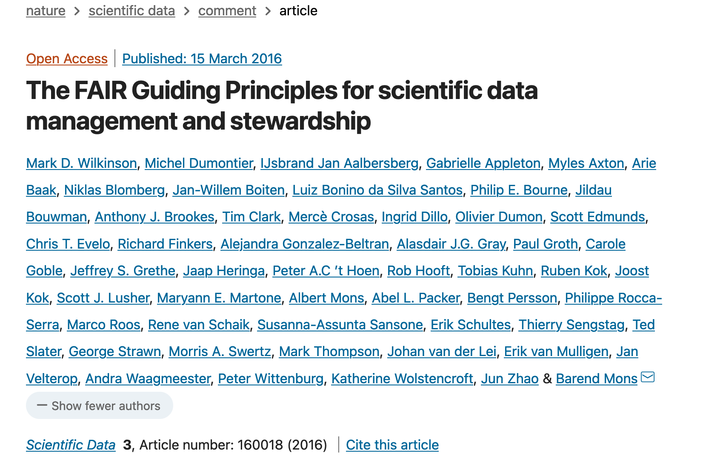
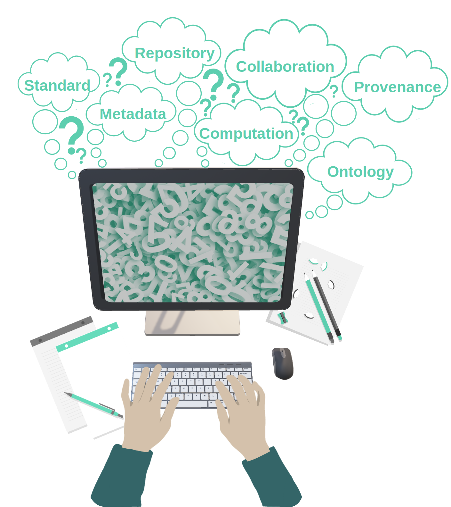

<!-- 
# Why research data management (RDM)?

- Increase transparency
- Make data accessible
- Save time (writing, reusing)
- Reduce the risk of data loss
- Optimize the costs
- Facilitate future reuse and sharing
- Improve citations

--- -->

# FAIR data stewardship

- **F**indable
- **A**ccessible
- **I**nteroperable
- **R**eusable

https://doi.org/10.1038/sdata.2016.18

---

# The FAIR principles

---

# Is your data FAIR?

**F**indable | **A**ccessible | **I**nteroperable | **R**eusable

- Where do you store your data?
- How do you annotate your data?
- How do you share your data?
- What tools do you use to analyse your data?
- How do you reuse other people's data?

<!-- 
---

# The research data life cycle

https://rdmkit.elixir-europe.org, [CC BY 4.0](https://creativecommons.org/licenses/by/4.0/) 

-->
