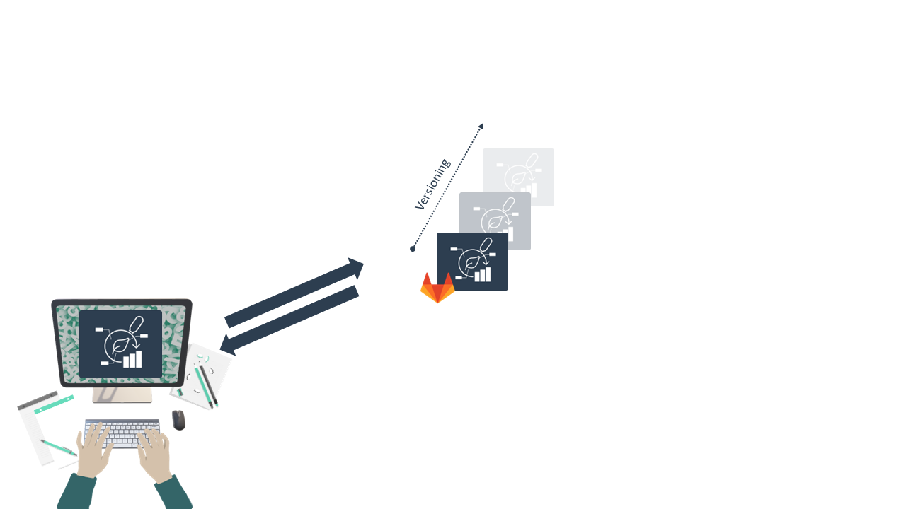
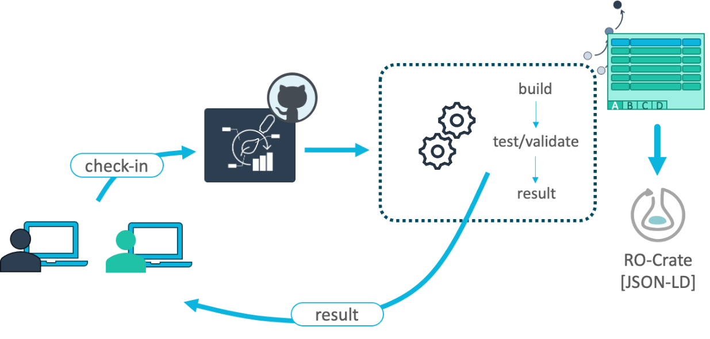
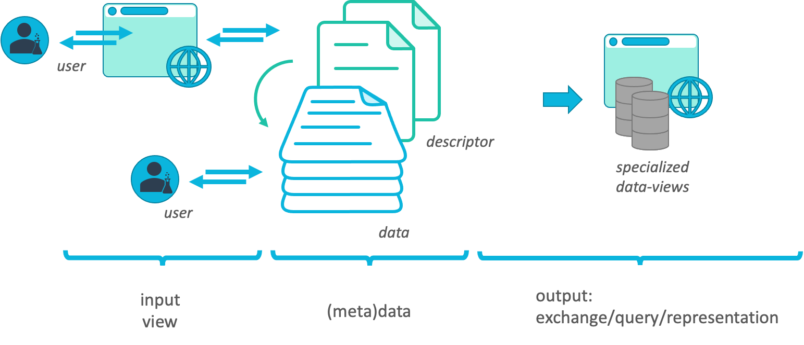
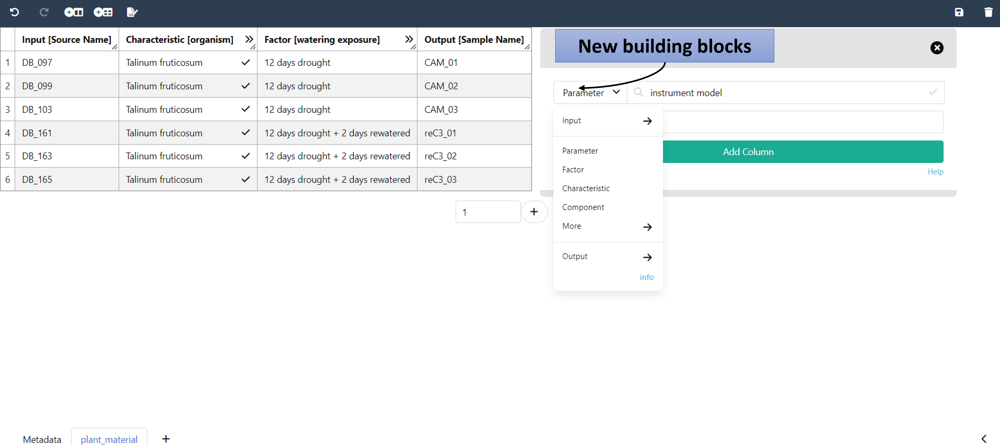

<!-- 

TODO 

- Galaxy
- ARC / metadata registry

-->

# Data Stewardship between DataPLANT and the community <!-- fit -->

---

# Annotated Research Context (ARC)

Your entire investigation in a single unified bag

---

# You can store your ARC in the DataHUB

---

# ARCs are versioned

---

# You can invite collaborators

---

# Collaborate and contribute

---

# Reuse data in ARCs

---

# Publish your ARC

---

# ARC as single-entry point

---

# From ARC to repositories

---

# Moving from paper to data publications

---

# Publish your ARC, get a DOI

---

# Publish your ARC with a few clicks

---

# Receive a DOI

---

# Metadata templates

Facilities and labs can define their common workflows as templates

---

# Validation

 adapted from Weil, H.L., Schneider, K., et al. (2023), PLANTdataHUB: a collaborative platform for continuous FAIR data sharing in plant research. Plant J. https://doi.org/10.1111/tpj.16474 

---

# Validate & publish

 Weil, H.L., Schneider, K., et al. (2023), PLANTdataHUB: a collaborative platform for continuous FAIR data sharing in plant research. Plant J. https://doi.org/10.1111/tpj.16474 

---

# Learning from Open-Source-Software development

---

# Data analysis and workflows

 Weil, H.L., Schneider, K., et al. (2023), PLANTdataHUB: a collaborative platform for continuous FAIR data sharing in plant research. Plant J. https://doi.org/10.1111/tpj.16474 

---

# Galaxy integration: Extra value for plant research

- Full ARC compatibility
- Automated metadata generation
- Specialized tools and workflows for ‘omics processing and analysis
- Public repository compatibility
- Galaxy teaching resource for data analysis

---

# Enabling platforms

  

  
  - Streamlined exchange of (meta)data
  - Communication and project management
  
  

  
  
  
  

---

# Streamlined data exchange

---

# Meet your collaborators in an ARC

---
<!-- 
# Mutable data life cycle

 Weil, H.L., Schneider, K., et al. (2023), PLANTdataHUB: a collaborative platform for continuous FAIR data sharing in plant research. Plant J. https://doi.org/10.1111/tpj.16474 

--- -->

# Project management

 Weil, H.L., Schneider, K., et al. (2023), PLANTdataHUB: a collaborative platform for continuous FAIR data sharing in plant research. Plant J. https://doi.org/10.1111/tpj.16474 

---

# DataPLAN &ndash; a DataPLANT DMP generator

**Zhou *et al.* (2023)**, DataPLAN: a web-based data management plan generator for the plant sciences, bioRxiv 2023.07.07.548147; doi: https://doi.org/10.1101/2023.07.07.548147 

https://dmpg.nfdi4plants.org

---

# Everything is a file

DataPLANT employs a **data-centric** approach to RDM

---

# No technical lock-in

(Meta)data transparency with tool assistance but **no technical lock-in**

---

# The ARC ecosystem

---

# What does an ARC look like?

---

# ARCs store experimental data

---

# Computations can be run inside ARCs

---

# ARCs come with comprehensive metadata

---

# ARC builds on standards

https://isa-tools.org/ | https://www.commonwl.org/
https://www.researchobject.org/ro-crate/ | https://git-scm.com

---

# The DataPLANT DataHUB &ndash; a GitLab ***Plus***

---
 
# ARC builds on ISA

ISA Tools: https://isa-tools.org/format/specification.html

---

# ARC builds on ISA to connect data

---

# ARC builds on ISA to link data

  

  - Samples are linked study-to-assay, assay-to-assay
  - Raw data is linked to assays
  - Protocols can be referenced
  - ...

  

  

  
  
  
  

---

# Annotation by flattening the knowledge graph

- Low-friction metadata annotation
- Familiar spreadsheet, row/column-based environment

---

# Annotation principle

- Low-friction metadata annotation
- Familiar spreadsheet, row/column-based environment

---

# Adding new building blocks

Swate can be used for the annotation of **isa.study.xlsx and isa.assay.xlsx** files

---

# Annotation Building Block types

  
  

  
- Input (e.g. Source Name, Sample Name)
- Protocol columns
- Characteristic // Parameter // Factor
- Output (e.g. Sample Name, Raw Data File, Derived Data File)

  
  

  
  
    
  

Let's take a detour on [Annotation Principles](https://nfdi4plants.org/nfdi4plants.knowledgebase/docs/teaching-materials/units/AnnotationPrinciples/isa_AnnotationPrinciples-slides.html)

---

# Ontology term search

Enable **related term directed search** to directly fill cells with child terms

---

# Fill your table with ontology terms

---

# Hierarchical combination of ontologies

---

# Checklists and Templates

Metadata standards or repository requirements can be represented as templates

---

# Realization of lab-specific metadata templates

Facilities can define their most common workflows as templates

---

# Directly import templates via Swate

- DataPLANT curated
- Community templates

