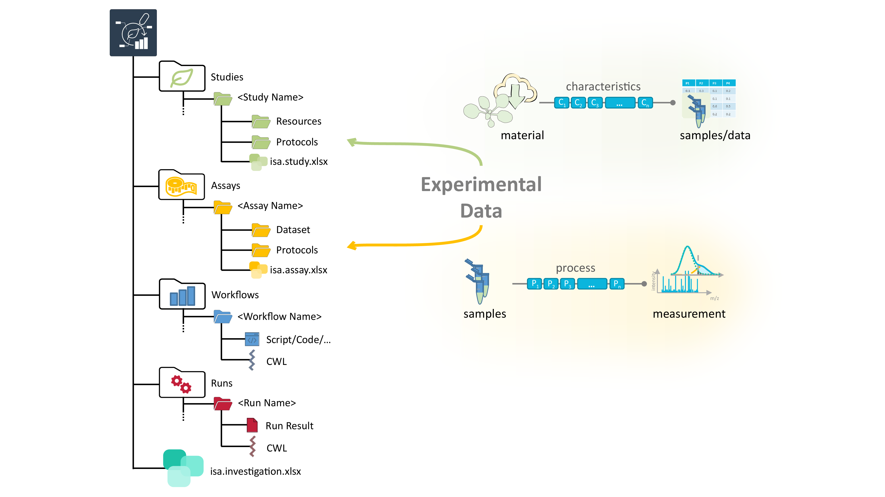
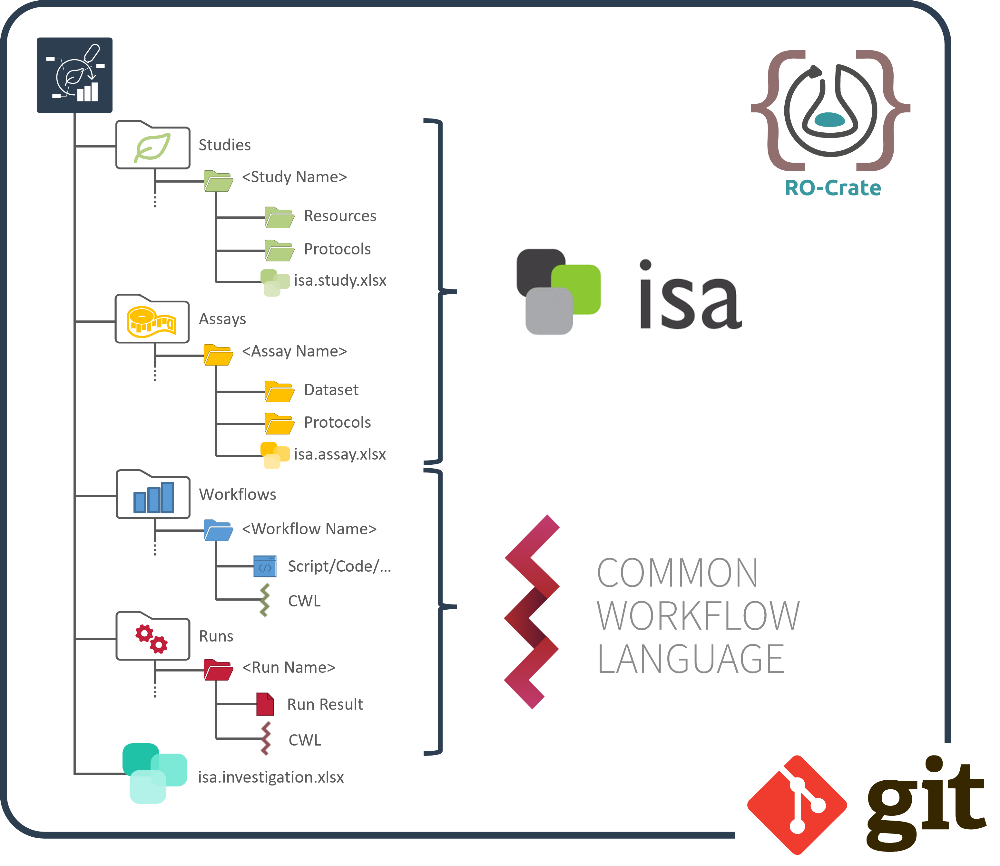
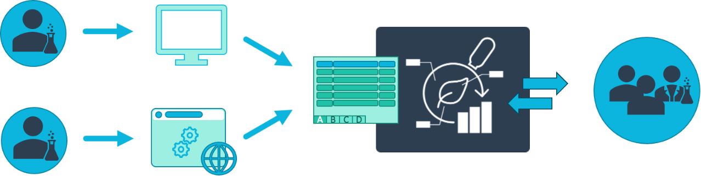
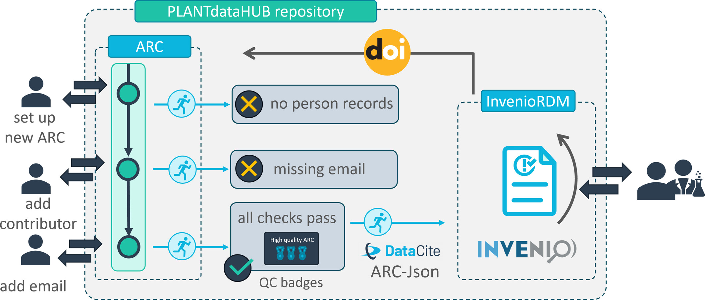

# Overview DataPLANT

---

# Data Stewardship between DataPLANT and the community

---

# Annotated Research Context (ARC)

Your entire investigation in a single unified bag

---

# What does an ARC look like?

---

# ARCs store experimental data

---

# Computations can be run inside ARCs

---

# ARCs come with comprehensive metadata

---

# ARC builds on standards

https://isa-tools.org/ | https://www.commonwl.org/
https://www.researchobject.org/ro-crate/ | https://git-scm.com

---

# The DataPLANT DataHUB &ndash; a GitLab ***Plus***

---

---

---

---

---

---

---

# Tool assistance

(Meta)data transparency with tool assistance but no technical lock-in

---

# Metadata templates

Facilities and labs can define their common workflows as templates

---

# Data analysis and workflows

 Weil, H.L., Schneider, K., et al. (2023), PLANTdataHUB: a collaborative platform for continuous FAIR data sharing in plant research. Plant J. https://doi.org/10.1111/tpj.16474 

---

# From ARC to repositories

---

# Moving from paper to data publications

---

# Publish your ARC, get a DOI

---

# Publish your ARC with a few clicks

---

# Validation

 adapted from Weil, H.L., Schneider, K., et al. (2023), PLANTdataHUB: a collaborative platform for continuous FAIR data sharing in plant research. Plant J. https://doi.org/10.1111/tpj.16474 

---

# Validate & publish

 Weil, H.L., Schneider, K., et al. (2023), PLANTdataHUB: a collaborative platform for continuous FAIR data sharing in plant research. Plant J. https://doi.org/10.1111/tpj.16474 

---

# Learning from Open-Source-Software development

---

# Receive a DOI

---

# ARC as single-entry point

---

# Enabling platforms

---

# Mutable data life cycle

 Weil, H.L., Schneider, K., et al. (2023), PLANTdataHUB: a collaborative platform for continuous FAIR data sharing in plant research. Plant J. https://doi.org/10.1111/tpj.16474 

---

# Project management

 Weil, H.L., Schneider, K., et al. (2023), PLANTdataHUB: a collaborative platform for continuous FAIR data sharing in plant research. Plant J. https://doi.org/10.1111/tpj.16474 

---

# DataPLAN &ndash; a DataPLANT DMP generator

**Zhou *et al.* (2023)**, DataPLAN: a web-based data management plan generator for the plant sciences, bioRxiv 2023.07.07.548147; doi: https://doi.org/10.1101/2023.07.07.548147 

https://dmpg.nfdi4plants.org

---

# The ARC ecosystem

---

# Conclusion

- ARC ecosystem supports the full data life cycle
- **Data-centric**: it's more about the data than tools or implementations

---

# A **data-centric** approach to RDM

---

# Resources

 DataPLANT (nfdi4plants)

Website: <a href="https://nfdi4plants.org/" target="_blank">https://nfdi4plants.org/</a>
Knowledge Base: <a href="https://nfdi4plants.org/nfdi4plants.knowledgebase/" target="_blank">https://nfdi4plants.org/nfdi4plants.knowledgebase/</a>
DataHUB: <a href="https://git.nfdi4plants.org" target="_blank">https://git.nfdi4plants.org</a>
GitHub: <a href="https://github.com/nfdi4plants" target="_blank">https://github.com/nfdi4plants</a>

---

# Continuous support  

Data managers in Düsseldorf, Cologne, Jülich and close by (CEPLAS, MibiNet, TRR341) offer support.

1. Slack Workspace for ad hoc support
2. Monthly user meeting (2nd Friday of the month)

[&rarr; Details](https://nfdi4plants.org/nfdi4plants.knowledgebase/docs/teaching-materials/disseminations/ARC-user-support_HHU-Uoc-FZJ/arc-user-support.html).

---

---

# Contributors

Slides presented here include contributions by

- name: Dominik Brilhaus
  github: https://github.com/brilator
  orcid: https://orcid.org/0000-0001-9021-3197
- name: Cristina Martins Rodrigues
  github: https://github.com/CMR248
  orcid: https://orcid.org/0000-0002-4849-1537
- name: Martin Kuhl
  github: https://github.com/Martin-Kuhl
  orcid: https://orcid.org/0000-0002-8493-1077
