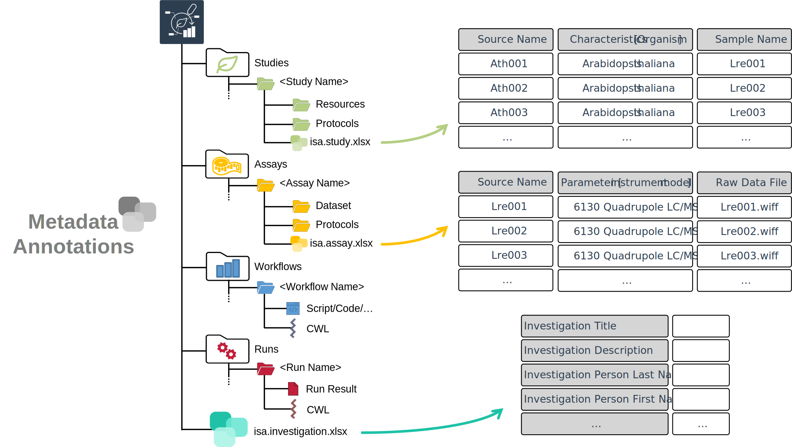
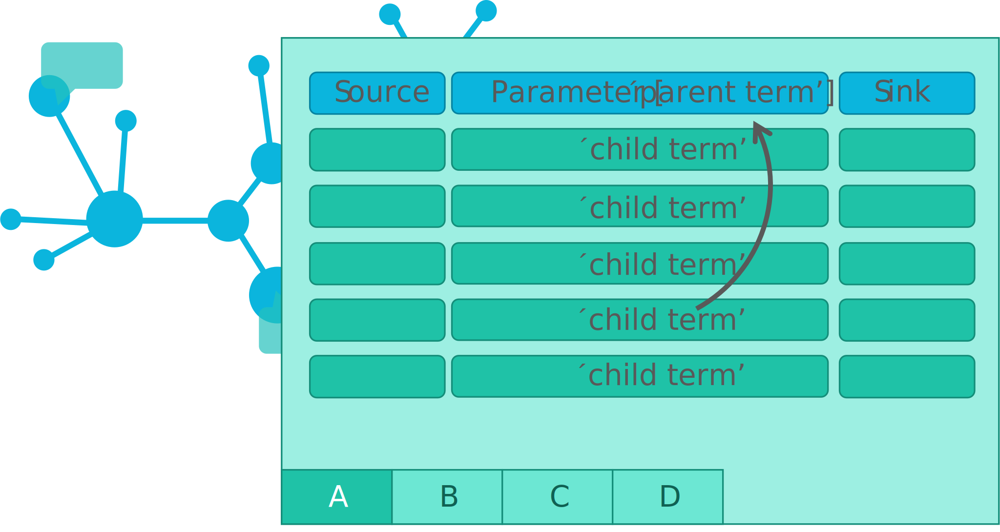

<!-- TODO 
- change .isa files to Swate alpha Layout?
- discuss registry of studies and assays -->
  
# Metadata and ISA

---

# ARC builds on ISA

<https://isa-tools.org/format/specification.html>

---

# ARC builds on ISA

---

# isa.<>.xlsx files within ARCs

---

# Study and assay files are registered in the investigation file <!-- fit -->

---

# The output of a study or assay file can function as input for a new isa.assay.xlsx

Output building blocks:

- Sample Name
- Raw Data File
- Derived Data File

---

#

---

# Swate

---

# Annotation by flattening the knowledge graph

- Low-friction metadata annotation
- Familiar spreadsheet, row/column-based environment

---

# Annotation principle

<!--  -->

- Low-friction metadata annotation
- Familiar spreadsheet, row/column-based environment

---

# Adding new building blocks (columns)

- Swate can be used for the annotation of **isa.study.xlsx and isa.assay.xlsx** files

---

# Annotation Building Block types <!--fit-->

- Source Name (Input)
- Protocol Columns
  - Protocol Type, Protocol Ref
- Characteristic
- Parameter
- Factor
- Component
- Output Columns
  - Sample Name, Raw Data File, Derived Data File

Let's take a detour on [Annotation Principles](https://nfdi4plants.org/nfdi4plants.knowledgebase/docs/guides/isa_AnnotationPrinciples.html) | [slides](https://nfdi4plants.org/nfdi4plants.knowledgebase/docs/teaching-materials/units/AnnotationPrinciples/isa_AnnotationPrinciples-slides.html)

---

# Ontology term search

Enable **related term directed search** to directly fill cells with child terms

---

# Fill your table with ontology terms

---

# Hierarchical combination of ontologies

<!-- combination of ISA (Characteristics, Parameter, Factor) and a biological or technological ontology (e.g. temperature, strain, instrument model) gives the flexibility to display an ontology term, e.g. temperature, as a regular process parameter or as the factor your study is based on (Parameter \[temperature\] or Factor \[temperature\]). -->

---

# Swate templates

---

# Checklists and Templates

Metadata standards or repository requirements can be represented as templates

---

# Realization of lab-specific metadata templates

Facilities can define their most common workflows as templates

---

# Directly import templates via Swate

- DataPLANT curated
- Community templates

---

---

# Contributors

Slides presented here include contributions by

- name: Dominik Brilhaus
  github: https://github.com/brilator
  orcid: https://orcid.org/0000-0001-9021-3197
- name: Martin Kuhl
  github: https://github.com/Martin-Kuhl
  orcid: https://orcid.org/0000-0002-8493-1077
- name: Sabrina Zander
  github: https://github.com/SabrinaZander
  orcid: https://orcid.org/0009-0000-4569-6126
  