<!-- 
TODO before final
- update agenda

-->

# CEPLAS ARC Training

<!--  _color: white; -->
<!-- _paginate: false -->
<style scoped>section {background: none; background-color: white;}</style>

<br>

May 24th, 2024

Dominik Brilhaus (CEPLAS)


---

# Training Materials

Slides are shared via [DataPLANT knowledge base](https://nfdi4plants.org/nfdi4plants.knowledgebase/docs/teaching-materials/events-2024/2024-04-03_CEPLAS-ARC-Trainings/)

---

# Resources &ndash; join the open source movement

###  DataPLANT (nfdi4plants)

Website: <a href="https://nfdi4plants.org/" target="_blank">https://nfdi4plants.org/</a>
Knowledge Base: <a href="https://nfdi4plants.org/nfdi4plants.knowledgebase/" target="_blank">https://nfdi4plants.org/nfdi4plants.knowledgebase/</a>
DataHUB: <a href="https://git.nfdi4plants.org" target="_blank">https://git.nfdi4plants.org</a>

GitHub: <a href="https://github.com/nfdi4plants" target="_blank">https://github.com/nfdi4plants</a>
HelpDesk: <a href="https://helpdesk.nfdi4plants.org" target="_blank">https://helpdesk.nfdi4plants.org</a>

:bulb: You can help us by raising issues, bugs, ideas...

---

# Continuous support

Data managers in Düsseldorf, Cologne, Jülich and close by (CEPLAS, MibiNet, TRR341) offer support.

1. Slack Workspace for ad hoc support
2. Monthly user meeting (2nd Friday of the month)

[&rarr; Details](https://nfdi4plants.org/nfdi4plants.knowledgebase/docs/teaching-materials/disseminations/ARC-user-support_HHU-Uoc-FZJ/arc-user-support.html).

<div>
  
  
  
</div>

---

# Introduce yourself

- Lab
- CEPLAS / TRR / MibiNet / ?
- Used code / programming language before
- Experience with Git / GitLab / GitHub?
- Have an ORCID
- My motivation / expectation
- My favorite lab assay

---

# Let's draw a typical lab workflow :pencil:

---

# FAIR data stewardship

- **F**indable
- **A**ccessible
- **I**nteroperable
- **R**eusable

https://doi.org/10.1038/sdata.2016.18


---

# The FAIR principles

<style scoped>

section p img {
width: 1100px;
height: 450px;
object-fit: cover;
/* object-position: 100% 100%; */
}
</style>


---

# Is your data FAIR?

**F**indable | **A**ccessible | **I**nteroperable | **R**eusable

- Where do you store your data?
- How do you annotate your data?
- How do you share your data?
- What tools do you use to analyse your data?
- How do you reuse other people's data?


---

# CEPLAS &ndash; One cluster, four locations

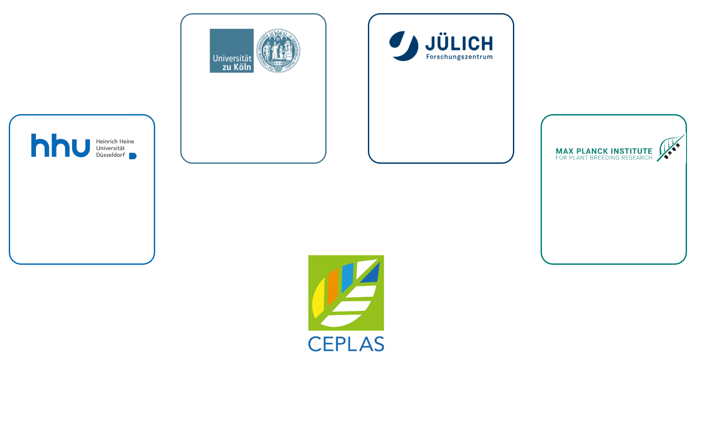

---

# Data silos impede collaboration

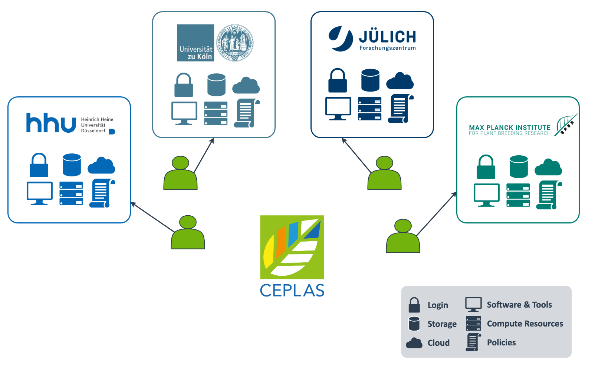

---

# Data silos impede collaboration

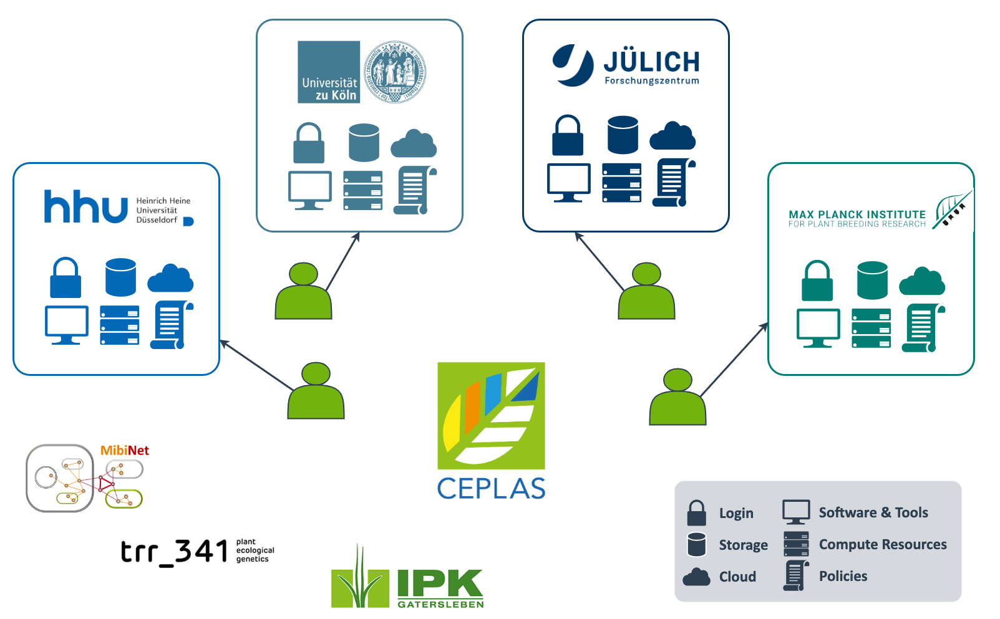

---

# Missing interfaces impede collaboration

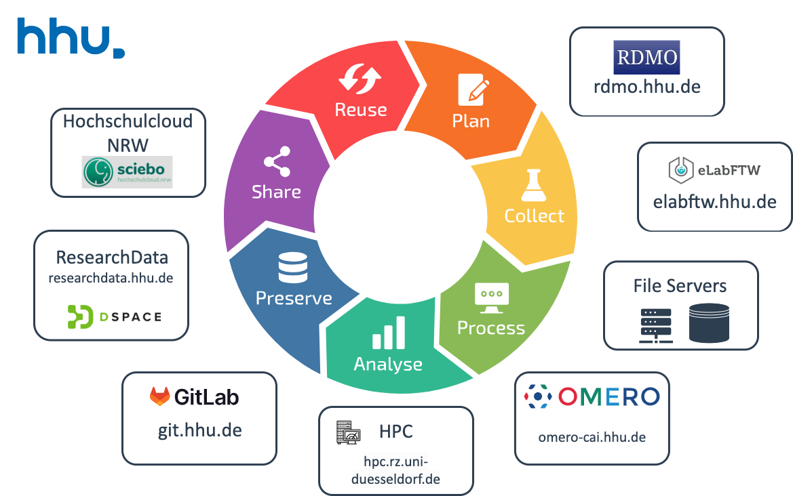

---


<!-- 

TODO 

- Galaxy
- ARC / metadata registry

-->

# Data Stewardship between DataPLANT and the community <!-- fit -->


---

# Annotated Research Context (ARC)

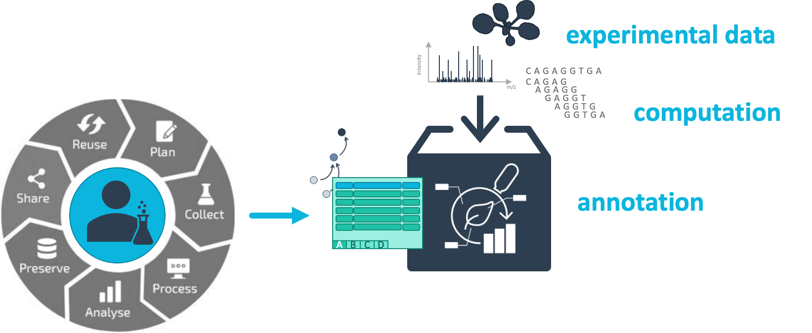

Your entire investigation in a single unified bag

---

# You can store your ARC in the DataHUB


---

# ARCs are versioned


---

# You can invite collaborators


---

# Collaborate and contribute


---

# Reuse data in ARCs


---

# ARC as single entry point


---

# From ARC to repositories

<style scoped>

section p img {
width: 1000px;
height: 400px;
object-fit: cover;
object-position: 100% 80%;
/* display: block; */;
}
</style>


---

# Publish your ARC, get a DOI


---


# Publish your ARC with a few clicks


---

# Receive a DOI


---

# Validation


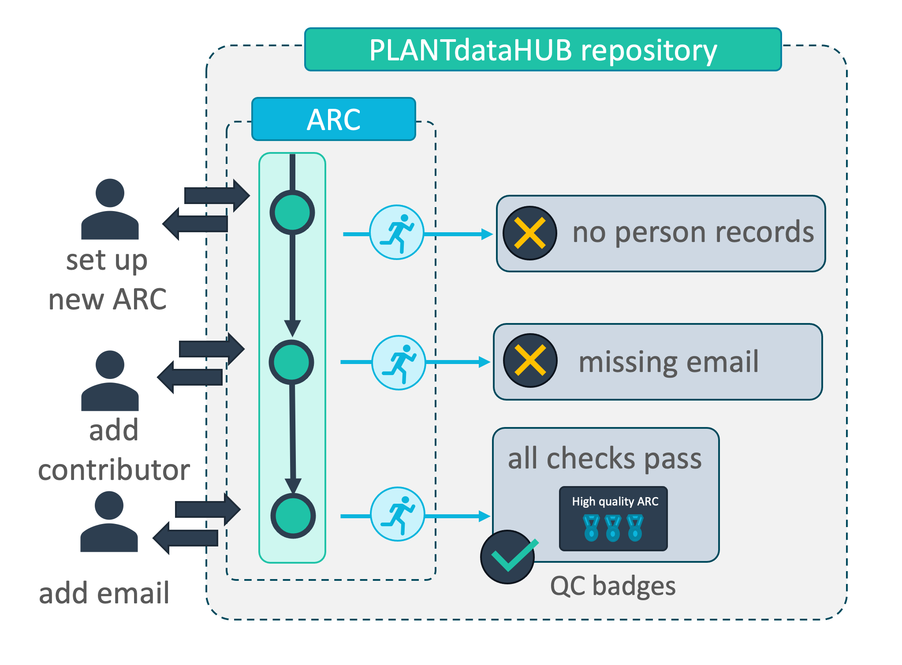

<span class="footer-reference"> adapted from Weil, H.L., Schneider, K., et al. (2023), PLANTdataHUB: a collaborative platform for continuous FAIR data sharing in plant research. Plant J. https://doi.org/10.1111/tpj.16474 </span>

---

# Validate & publish


<span class="footer-reference"> Weil, H.L., Schneider, K., et al. (2023), PLANTdataHUB: a collaborative platform for continuous FAIR data sharing in plant research. Plant J. https://doi.org/10.1111/tpj.16474 </span>

---


# Data analysis and workflows


<span class="footer-reference"> Weil, H.L., Schneider, K., et al. (2023), PLANTdataHUB: a collaborative platform for continuous FAIR data sharing in plant research. Plant J. https://doi.org/10.1111/tpj.16474 </span>

---

# Galaxy integration: Extra value for plant research

<div class="two-columns">
<div>


</div>

<div>

- Full ARC compatibility
- Automated metadata generation
- Specialized tools and workflows for ‘omics processing and analysis
- Public repository compatibility
- Galaxy teaching resource for data analysis

</div>
</div>

---

# Enabling platforms


<div class="two-columns">
  <div>
  
  - Streamlined exchange of (meta)data
  - Communication and project management
  
  </div><div>
  
  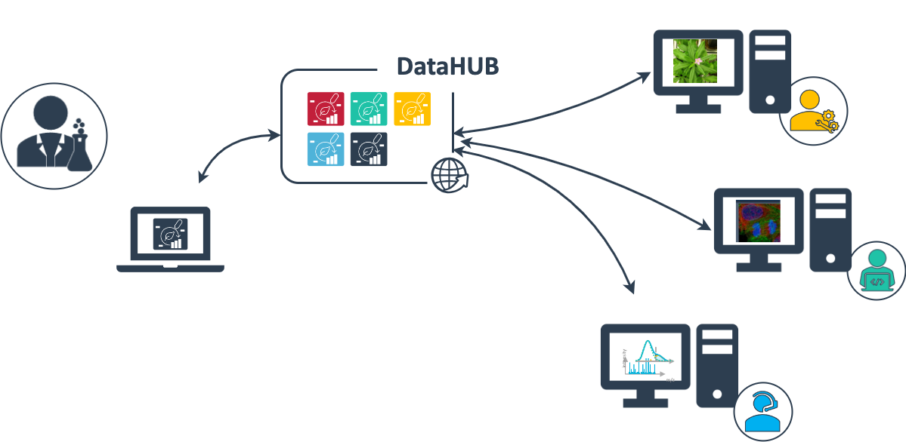
  
  </div>
</div>


---

# Streamlined data exchange


---

# Meet your collaborators in an ARC


---
<!-- 
# Mutable data life cycle


<span class="footer-reference"> Weil, H.L., Schneider, K., et al. (2023), PLANTdataHUB: a collaborative platform for continuous FAIR data sharing in plant research. Plant J. https://doi.org/10.1111/tpj.16474 </span>

--- -->

# Project management


<span class="footer-reference"> Weil, H.L., Schneider, K., et al. (2023), PLANTdataHUB: a collaborative platform for continuous FAIR data sharing in plant research. Plant J. https://doi.org/10.1111/tpj.16474 </span>

---

# DataPLAN &ndash; a DataPLANT DMP generator

<span class="footer-reference">**Zhou *et al.* (2023)**, DataPLAN: a web-based data management plan generator for the plant sciences, bioRxiv 2023.07.07.548147; doi: https://doi.org/10.1101/2023.07.07.548147 </span>

https://dmpg.nfdi4plants.org


---

# Everything is a file

DataPLANT employs a **data-centric** approach to RDM


---

# No technical lock-in


(Meta)data transparency with tool assistance but **no technical lock-in**

---

# The ARC ecosystem


---

# What does an ARC look like?


---

# ARCs store experimental data


---

# Computations can be run inside ARCs


---

# ARCs come with comprehensive metadata


---

# ARC builds on standards

<div class="two-columns">
  <div>
  
  
  
  </div>
  <div>
  
  - RO-Crate: standardized exchange
  - ISA: structured, machine-readable metadata
  - CWL: reproducible, re-usable data analysis
  - Git: version control
  
  </div>
</div>

<span class="footer-reference">https://isa-tools.org/ | https://www.commonwl.org/
https://www.researchobject.org/ro-crate/ | https://git-scm.com</span>

<!-- 
---

# The DataPLANT DataHUB &ndash; a GitLab ***Plus***

 

-->

---


# The DataPLANT DataHUB &ndash; a GitLab ***Plus***


---

# On-premise DataHUBs

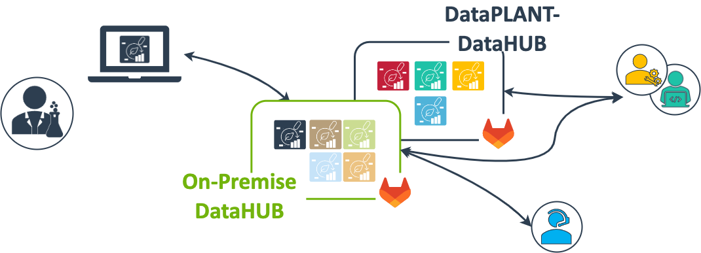

ARC services are available as on-premise option

---

# HHU-DataHUB

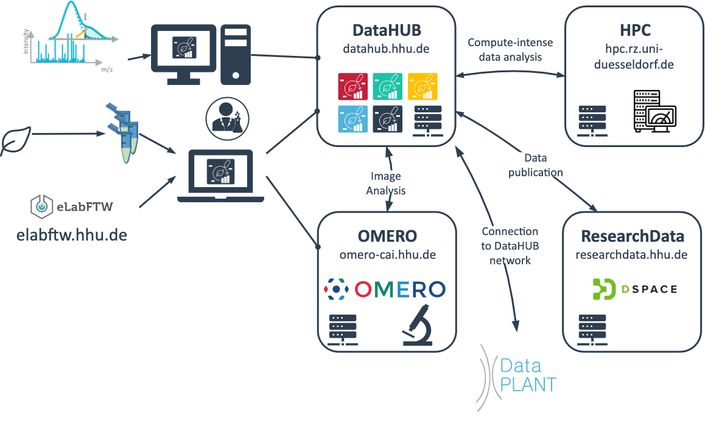

---

# HHU-DataHUB

- FAIR data along the research data cycle
- Structured exchange of (meta)data
- Local (long-term) storage, backup, version control
- Integration of existing services and infrastructure
- External collaboration


---

# HHU-DataHUB &ndash; Node for platforms


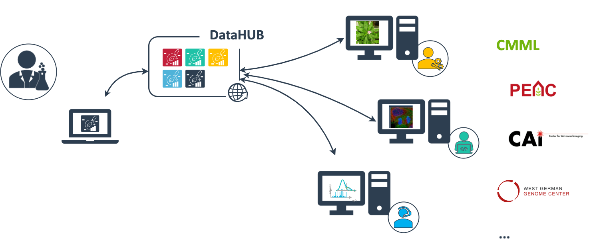

---

# Embedded into an RDM network

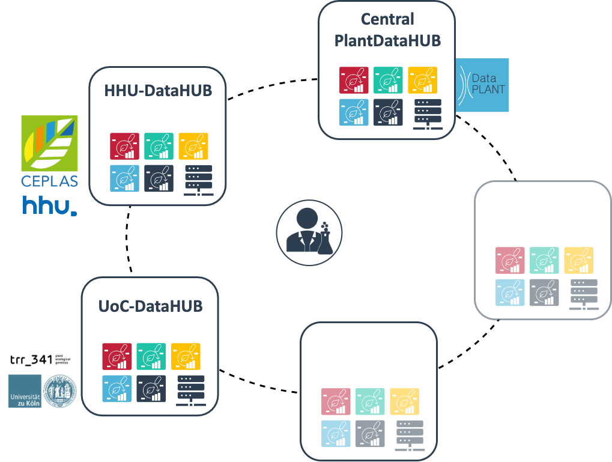

---

# CEPLAS collaborates with DataPLANT and NFDI4BIOIMAGE <!-- fit -->

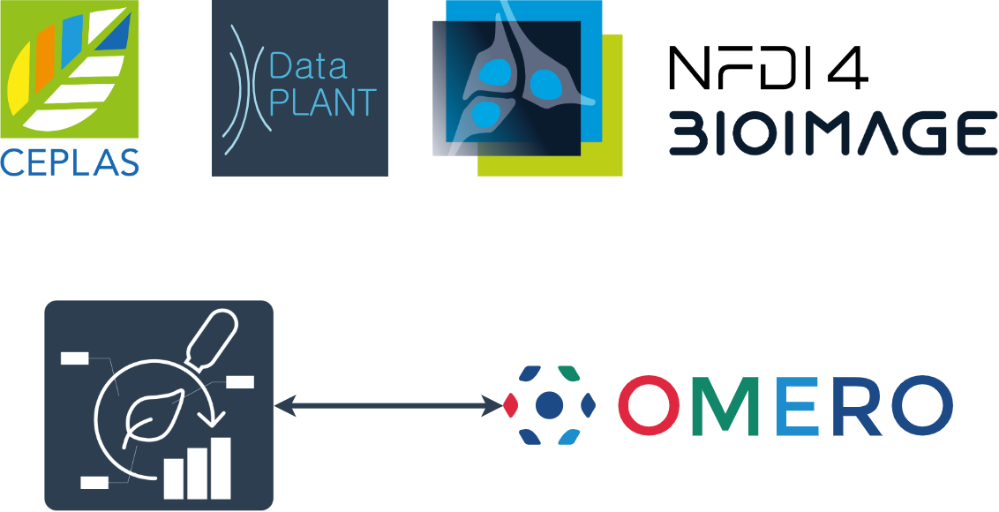

---

# CEPLAS Research Data Policy

<div class="two-columns">
  <div>
  
  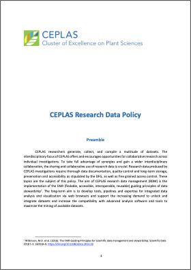
  
  </div>
  <div>

  
    
  </div>
</div>

---


<!-- TODO 

- more to remote?
- add history panel
- add Swate alpha examples in ARCitect ???
- check linking studies and assays

-->


# ARCitect Hands-on

<style scoped>section {background: none; background-color: white}</style>
<!-- _paginate: false -->

---

# ARCitect installation

Please install version **v0.0.31** (or later) of the ARCitect: https://github.com/nfdi4plants/ARCitect/releases/latest

---

## Download the demo data <!-- fit -->

https://nfdi4plant.sharepoint.com/:f:/s/Teaching/Eik7k-oJiMREgZ24kto7sIYBGxHmmZlS_Kzf7psk-5w-xg?e=u0sADd


---

# Sort Demo data in an ARC


---

# Open ARCitect

1. Login to DataHUB (1)
   
2. Select `git.nfdi4plants.org` as Host 
    
---

# Initiate the ARC folder structure


1. Create a **New ARC** (2)
2. Select a location and name it **TalinumPhotosynthesis**

---

# Your ARC's name

<style scoped>section {font-size: 25px;}</style>

üí° By default, your ARC's name will be used
   - for the ARC folder on your machine
   - to create your ARC in the DataHUB at `https://git.nfdi4plants.org/<YourUserName>/<YourARC>` (see next steps)
   - as the identifier for your investigation

üí° Make sure that no ARC exists at  `https://git.nfdi4plants.org/<YourUserName>/<YourARC>`. Otherwise you will sync to that ARC.


---

# Add a description to your investigation


---

# Add a contributor


- you could also add the contacts directly via ORCID
---

# Add a study

by clicking "Add Study" and entering an identifier for your study

Use **talinum_drought** as an identifier


---

# Study panel

In the study panel you can add

- general metadata,
- people, and
- publications
- data process information


<!-- TODO show connected assays -->
---


# Add an assay

by clicking "Add Assay" and entering an identifier for your assay

Add two assays with **rnaseq** and **metabolomics** as an identifier


---

# Link your assay to a study

You can either
- link your new assay to an existing study in your ARC or
- create a new one
  
Link your assays to your **talinum_drought** study


---

# Add information about your assay

In the assay panel you can define the assay's
 - measurement type
 - technology type, and
 - technology platform


---

# Add protocols

You can either
- directly write a **new protocol** within the ARCitect or
- import an existing one from your computer


---

# Add protocols and datasets

In the file tree you can
  - **import dataset files or folders** and 
  - **protocols** associated to that dataset.

:bulb: **Import Dataset** allows to import data from any location on your computer into the ARC.

:warning: Depending on the file size, this may take a while. Test this with a small batch of files first.


---

# Sort Demo Data to your ARC

üí° protocols and multiple datasets can directly be imported via ARCitect

---

# Explorer

The **Explorer (6)** button directly opens your ARC locally


---

# Commit panel (7)

You have to commit changes before you can upload to the DataHUB


---
If you are logged in, the **Commit panel** shows
- your DataHUB's *Full Name* and *eMail*

It allows you to
- track changes of the ARC with git
- add a commit message 
- use different branches 


---

# Upload your local ARC to the DataHUB

From the sidebar, navigate to **DataHUB Sync** (8)


---


# DataHUB Sync

The DataHUB Sync panel allows you to
- sync the changes to the DataHUB: **Push**
- sync from the DataHUB: **Pull**, and
- change the Remote for the synchronization


 

<!-- TODO more to remote?-->
---


# Check if your ARC is successfully uploaded

1. [sign in](https://auth.nfdi4plants.org/realms/dataplant/login-actions/registration?client_id=account&tab_id=4bQkU161waI) to the DataHUB 
2. Check your projects

---

# Your ARC is ready

<style scoped>

section p br {
   display: block;
   margin-top: 20px;
   content: "";
}
</style>

👩‍💻 Initiated an ARC
<br>
📂 Structured and ...  
<br>
 ... annotated experimental data
<br>
üåê Shared with collaborators


---

---

# Received two emails from "GitLab" about a failed pipeline? <!-- fit -->


:fire: Don't worry :smile:

---

## Pipeline Failed


- a "continuous quality control" (CQC) pipeline validates your ARC
- This fails if one of the following metadata items is missing:

    ```bash
    Investigation Identifier
    Investigation Title
    Investigation Description
    Investigation Person Last Name
    Investigation Person First Name
    Investigation Person Email
    Investigation Person Affiliation
    ```  

---

## Pipeline Failed

If the pipeline has failed once, it is disabled by default


---

## Reactivate the CQC pipeline

<style scoped>
section {font-size: 22px;}
</style>

To reactivate it and let the DataHUB validate your ARC again:
  
  1. navigate to CI/CD setting `<arc-url>/-/settings/ci_cd`
  2. expand "Auto DevOps"
  3. check box "Default to Auto DevOps pipeline"
  4. Save changes


---


# DataHUB concepts and terminology

---

<!-- TODO 

# Terminology

- commit
- repository / repo
- push / pull
- branch / fork

# add comparison GitLab vs. Cloud Services

---
-->

# Where do I store my ARC?


---

# ARC storage and sharing


- DataHUB as "ground truth" / original clone
- You can sync and communicate all changes to your ARC via the DataHUB

<span style="font-size:0.8em"> :bulb: ARCitect and ARC commander provide options to avoid syncing large files (LFS = Large file storage) </span>

---

# Example setup to store and use ARCs

<div class=two-columns style="font-size: 25px">

  <div>
  
  ### Personal computer

  - work on small files
  - annotate metadata
  - add scripts, protocols
  
  ### Workstation / Server

  - work on large files
  - run computations
  
  </div>
  <div>

  ### FileShare
  
  - mount to local machine, sync ARC from there
  
  ### HPC

  - direct connection HPC to DataHUB (depends on security settings)
  - or mount to local machine and sync, ARC from there
  
  
  </div>

</div>

---


# **Projects** and **Groups** are not the same

- "Project" = ARC
- "Groups" = Group of users

---

## Project = ARC

- In the DataHUB, ARCs are called "projects"; they are the same.
- An ARC can be shared with individual users (invited as "members") or a group.

---

## DataHUB Groups

- A "Group" is a group of users with specific [permissions](#roles-and-permissions)
- A group can share ARCs
- A group can be invited to an ARC
- Groups can have subgroups

---

# Options to share an ARC via the DataHUB

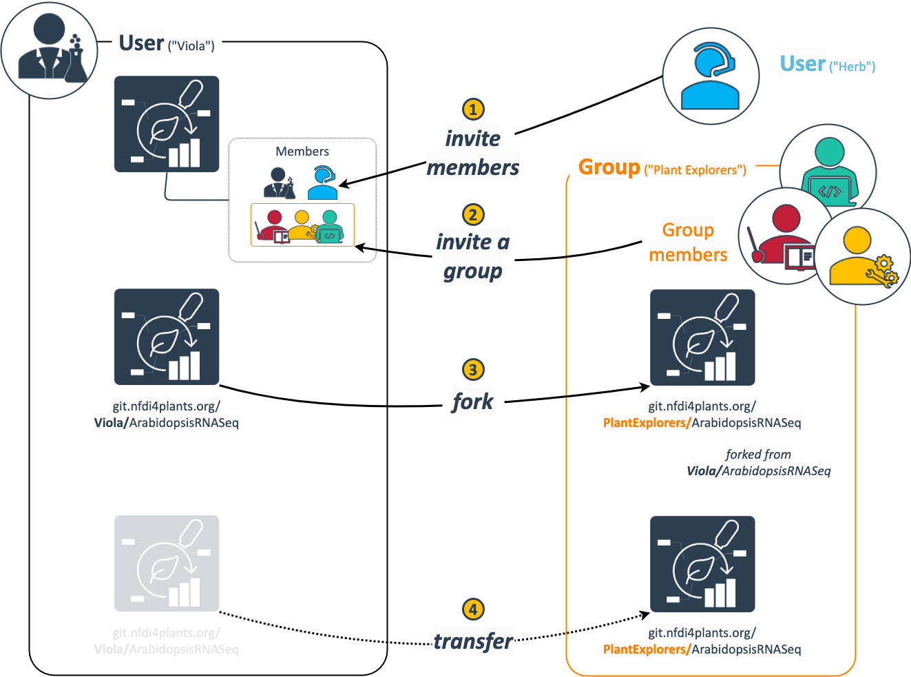

---

# Namespaces

- Every user has a personal namespace, where they can upload or create new ARCs
- Every group and subgroup has its own namespace

<div class="table-container" style="font-size: 25px">

Type | URL | Namespace | Name
--- | --- | --- | --- 
A **personal** ARC | https://git.nfdi4plants.org/brilator/Facultative-CAM-in-Talinum | `brilator` | Dominik Brilhaus
An **group**-shared ARC | https://git.nfdi4plants.org/hhu-plant-biochemistry/Samuilov-2018-BOU-PSP | `hhu-plant-biochemistry` | HHU Plant Biochemistry

</div>

:bulb: **Personal** is not the same as **private**

---

# Visibility

The visibility of ARCs and groups can be managed individually for each ARC or group
  
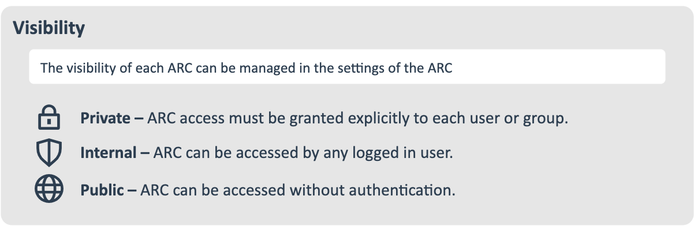

:bulb: By default every ARC and every group is set to **private**.

---

# Permissions & Roles

When inviting new members to an ARC or group, you can choose between different levels.

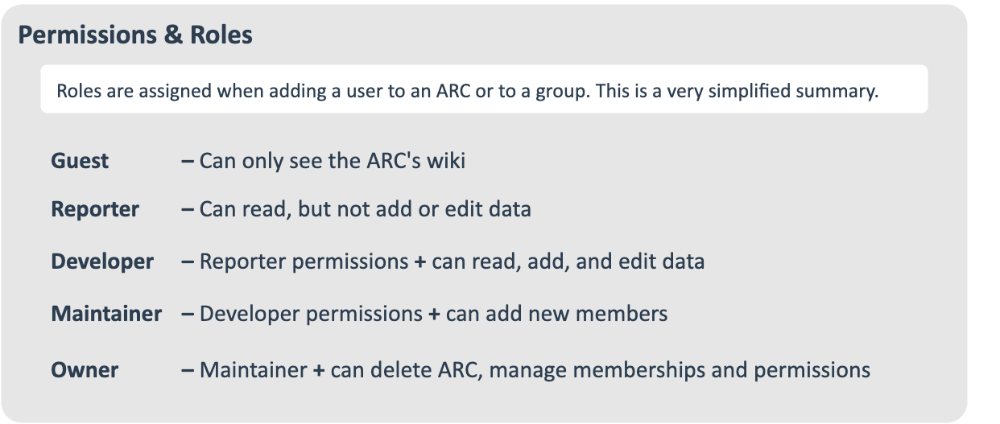

:bulb: By default you are **Owner** of an ARC you create or upload to the DataHUB.

---

# ARC DataHUB members // ARC Investigation contacts <!-- fit -->

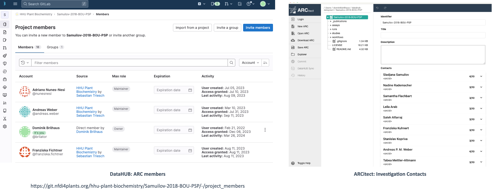

:bulb: Investigation contacts are not automatically invited as members to the ARC.

---


# DataHub Hands-On

---

# Navigation Bar


1. navigate directly to the [projects panel](./../../../../../../DataHUB-Manual/datahub-Manual/datahub-projectsPanel.html) via the icon in the top-left (1)
2. open the [hamburger Menu](#hamburger-menu) (2)
3. use the search field (3) to find ARCs, users and groups
4. open the [avatar Menu](#avatar-menu) (4)

---

# Hamburger Menu

<div class="two-columns">

<div style="padding: 100px 0;">

1. From the hamburger menu (1) you can
2. navigate to the [projects](./../../../DataHUB-Manual/datahub-projectsPanel.html) (2)
3. or [groups](datahub-groupsPanel.html) (3) panels

</div>

<div>


</div>
</div>

---

# Avatar Menu

<div class="two-columns">

<div>

1. In the avatar menu (1) you can
2. find your profile name and user name (2), 
3. navigate to the [user settings](./../../../DataHUB-Manual/datahub-userSettings.html) (3)
4. or sign out (4) of the DataHUB.

</div>

<div>


</div>
</div>

---

# Projects Panel


1. Choose a tab (1) to see only your ARCs, or explore other publicly available ARCs. 
2. The main panel (2) lists all ARCs
3. Here you can also see, the visibility level (3), and 
4. your permission or role (4) for the listed ARC. 
5. You can create a **New Project** in the top-right corner (5).

---

# ARC Panel

The ARC Panel is the main working area for your ARC.


---

# ARC Panel &ndash; sidebar


<div class="two-columns">

<div>

1. access the project information (1), e.g. invite members to the ARC
2. follow the progress of your ARC repository (2),
3. organize tasks in issue lists and boards (3),
4. take notes in a wiki to your ARC (4),
5. adapt the [settings (5) of the ARC](datahub-ARCSettings.html).

</div>

<div>


</div>
</div>


---

# ARC Panel &ndash; main panel

<div class="two-columns">

<div>

6. see the ARC's name and visibility level (6),
7. follow the ARC's commit history (7),
8. see files contained in your ARC just like on your computer (8),
9. add new files or directories (9), and
10. download or clone your ARC (10).

</div>

<div>


</div>
</div>

---

# Collaborate and share


---

# Invite collaborators

* Unless changed, your ARC is set to private by default.
* To collaborate, you can invite lab colleagues or project partners to your ARC by following the steps on the subsequent slides. 
* To get started [sign in](https://auth.nfdi4plants.org/realms/dataplant/login-actions/registration?client_id=account&tab_id=4bQkU161waI) to the DataHUB and open the ARC you want to share.

---

1. Click on **Project Information** in the left navigation panel


---

2. Click on **Members**


---

3. Click on **Invite members**


---

4. Search for potential collaborators


---

5. Select a role


---

# Choosing the proper role

<style scoped> section{font-size: 22px;}</style>

<u>Guests</u>
Have the least rights. They will not be able to see the content of your ARC (only the wiki page).

<u>Reporters</u>
Have **read access** to your ARC. This is recommended for people you ask for consultancy.

<u>Developers</u>
The choice for most people you want to invite to your ARC. Developers have **read and write access**, but cannot maintain the project on the DataHUB, e.g. inviting others.

<u>Maintainers</u> 
Gives the person the same rights as you have (except of removing you from your own project). This is recommended for inviting PIs or group leaders allowing them to add their group members for data upload or analysis to the project as well.

*A detailed list of all permissions for the individual roles can be found [here](https://docs.gitlab.com/ee/user/permissions.html)*

---

# <div align="center">Congratulations!</div>
<div align="center">You have just shared your ARC with a collaborator.</div>

<style scoped>

section p img {
width: 1000px;
height: 300px;
object-fit: cover;
object-position: 100% 45%;
/* display: block; */;
}
</style>

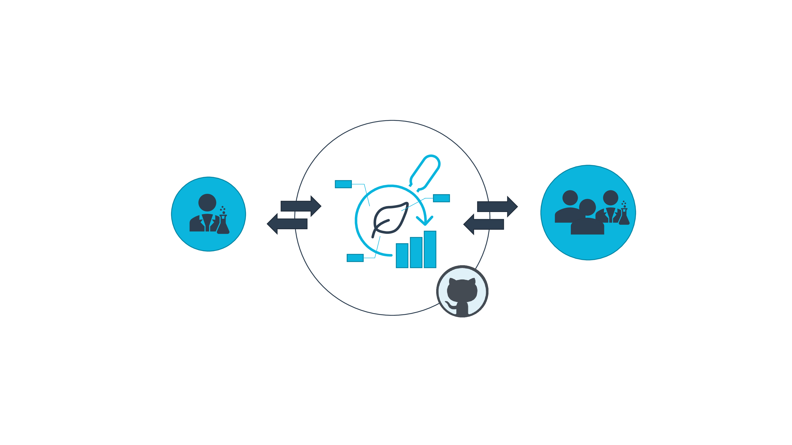

---


# Version control

Check out the **commit history** of your ARC via Repository (2) or directly via commits (7)


---

# Project Management

Add issues to your ARC (3)


---

# ARCs come with their own wiki space

<div class="two-columns">

<div style="font-size: 27px">

- directly associated to your ARC
- same access rights as your ARC
- share meeting minutes or ideas with collaboration partners
- keep ARC clean of files that are not considered "research data"

</div>

<div>


</div>
</div>

---


# ARCs come with comprehensive metadata


---

# ARC builds on standards


<span class="footer-reference">https://isa-tools.org/ | https://www.commonwl.org/
https://www.researchobject.org/ro-crate/ | https://git-scm.com</span>

---
 
# ARC builds on ISA

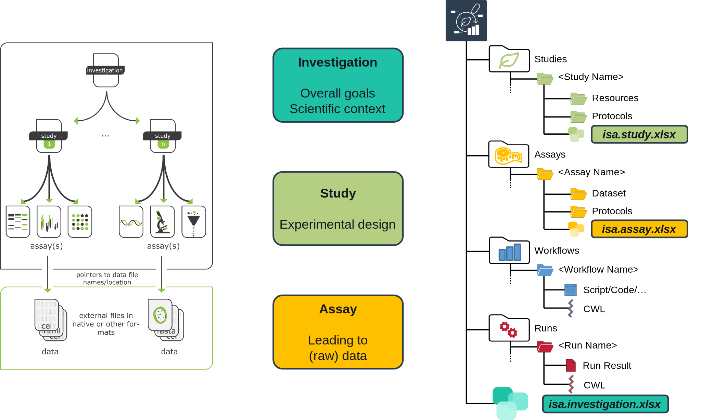

<span class="footer-reference">ISA Tools: https://isa-tools.org/format/specification.html</span>

---

# ARC builds on ISA to connect data


---

# ARC builds on ISA to link data

<div class="two-columns">

  <div>

  - Samples are linked study-to-assay, assay-to-assay
  - Raw data is linked to assays
  - Protocols can be referenced
  - ...

  </div>

  <div>
  
  
  
  </div>
</div>


---

# Annotation by flattening the knowledge graph


- Low-friction metadata annotation
- Familiar spreadsheet, row/column-based environment

---

# Annotation principle


- Low-friction metadata annotation
- Familiar spreadsheet, row/column-based environment

---

# Adding new building blocks


Swate can be used for the annotation of **isa.study.xlsx and isa.assay.xlsx** files

---

# Annotation Building Block types

<div class="two-columns" style="font-size: 25px">
  
  <div>
  
- Input (e.g. Source Name, Sample Name)
- Protocol columns
- Characteristic // Parameter // Factor
- Output (e.g. Sample Name, Raw Data File, Derived Data File)

</div>
  
  <div>
  
  
    
  </div>
</div>


Let's take a detour on [Annotation Principles](https://nfdi4plants.org/nfdi4plants.knowledgebase/docs/teaching-materials/units/AnnotationPrinciples/isa_AnnotationPrinciples-slides.html)

---

# Ontology term search

<style scoped>
h1{
  text-align: left
}
section {
  text-align: center;
}
</style>


Enable **related term directed search** to directly fill cells with child terms

---

# Fill your table with ontology terms


---

# Hierarchical combination of ontologies


---

# Checklists and Templates


Metadata standards or repository requirements can be represented as templates

---

# Realization of lab-specific metadata templates


Facilities can define their most common workflows as templates

<style scoped>
h1{
  text-align: left
}
section {
  text-align: center;
}
</style>

---

# Directly import templates via Swate

- DataPLANT curated
- Community templates


---


# Swate hands-on with demo data

---

# Goals

- Get familiar with ISA metadata and Swate
- Annotate data in your ARC

---

# Download the demo data


1. Open the ARCitect
2. Login (1) to your DataHUB account
3. Navigate to **Download ARC** (4)

---

# Download the demo data

4. Search for **Talinum-CAM-Photosynthesis**
5. Click the download button, select a location and open the ARC.
6. Open the downloaded ARC


:bulb: This is basically the ARC we created in the last session.

---

# Alternative: Use Swate standalone

Open [Swate standalone](https://swate-alpha.nfdi4plants.org) in web browser

:bulb: Alternatively, you can use Swate as [Excel Plugin](./../../../SwateManual/Docs01-Installing-Swate.html), but this is outdated

---

# Swate Overview


---

# Let's annotate the plant samples first

1. Check out the lab notes `studies/talinum_drought/protocols/plant_material.txt`

<div class="two-columns">

<div>

*ARCitect*

2. Select the study `talinum_drought`
3. Add a new table

</div>

<div>

*Swate standalone*

Import the empty `studies/talinum_drought/isa.study.xlsx`

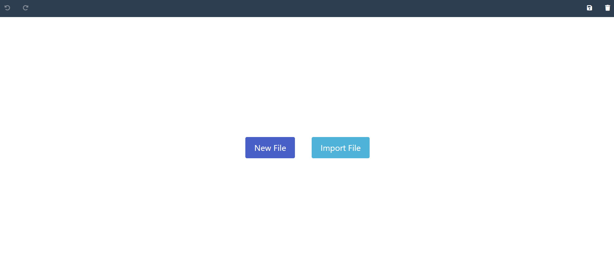

</div>

</div>

---

## Create an annotation table

Create a Swate annotation table by adding **Building blocks** via the widget (A) or the sidebar (B)

:bulb: Each table can contain only one *Input* and one *Output* column  

:bulb: different *Input* and *Output* options: `Source Name`, `Sample Name`, `Material`, `Raw Data File`, `Derived Data File`, `Image File`

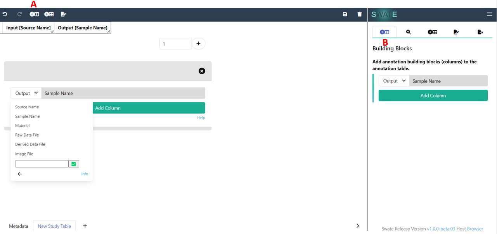

---

## Add more Building blocks

1. Add an *Input* (`Source Name`) and *Output* (`Sample Name`) column
2. Select *Characteristic* from the drop-down menu
3. Enter `organism` in the search bar. This search looks for suitable *Terms* in our *Ontology* database.
4. Select the Term with the id `OBI:0100026` and, 
5. Click Add Column

:bulb: This adds four columns to your table, one visible and **three** hidden.


---

## Insert values to annotate your data

1. Insert values by selecting any cell below `Characteristic [organism]`
2. Use free text or use the magnifying glass to activate *Term* search
3. Write "Talinum fruticosum" and enable *Term* search
4. Select the hit 


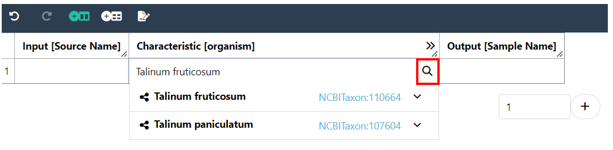

---

## Add a Building block with a unit

1. In the *Building Blocks* widget, select *Parameter*, search for `light intensity exposure` and select the term with id `PECO:0007224`.
2. Check the box for *Unit* and search for `microeinstein per square meter per second` in the adjacent search bar.
3. Select `UO:0000160`.
4. Click Add Column.

:bulb: This also adds four columns to your table, one visible and **three** hidden.


---

## Insert unit-values to annotate your data

In the annotation table, select any cell below `Parameter [light intensity exposure]` and add "425" as light intensity.

:bulb: You can see the numbers being complemented with the chosen unit, e.g. `425 microeinstein per square meter per second`

---

## Showing ontology reference columns

Use double pointed quotation mark to un-hide hidden columns. 

:bulb: You can see that your organism of choice was added with id and source Ontology in the reference (hidden) columns.


---

## Your ISA table is growing

At this point. Your table should look similar to this:


---

## Exercise :pencil:

Try to add suitable *Building Blocks* for other pieces of metadata from the plant growth protocol (`studies/talinum_drought/protocols/plant_material.txt`).

---

## Add a factor building block

1. In the *Building Blocks* widget, select *Factor*, search for `watering exposure` and select the term with id `PECO:0007383`.
2. Click <kbd>Add Column</kbd>.
3. Add the drought treatment ("no water for 12 days", "re-water for 2 days") to the respective samples

:bulb: There are different options to add the drought treatment.

---

## Link the protocol to the isa table

1. In the *Building Blocks* tab, select *More* -> *Protocol REF*.
2. Click <kbd>Add Column</kbd>.
3. Add the name of the protocol file (plant_material.txt) to the *Protocol REF* column.

:bulb: This allows you to reference the free-text, human-readable protocol.

---

## Fill out source name and sample name

Transfer the sample ids from the protocol.

1. Invent names for `Source Name` (we do not have this information)
2. Use the sample names (DB_*) as `Sample Name`

---

## Let's annotate the RNA Seq data

1. Navigate to the demo ARC. 
2. Open the lab notes `assays/rnaseq/protocols/RNA_extraction.txt` in a text editor.
3. Import the empty `assays/rnaseq/isa.assay.xlsx` workbook in Swate.

---

## Use a template

1. Open the *Templates* widget in the Bar 

:bulb: Here you can find DataPLANT and community created workflow annotation templates

1. Search for `RNA extraction` and click <kbd>select</kbd> 
    - You will see a preview of all *Building Blocks* which are part of this template.
2. Click <kbd>Add template</kbd> to add all *Building Blocks* from the template to your table, which <u>do not exist yet</u>.


---

## Remove Building blocks

If there are any *Building Blocks* which do not fit to your experiment you can use right click --> "Delete Column" to remove it including all related (hidden) reference columns.

---

## Move Building blocks
If the order of the *Building Blocks* should be adjusted you can use right click --> "Move Column"


---

## Replace multiple names 

Right click --> "Update Column" can be used to replace names in batches
:bulb: this only works on Input columns
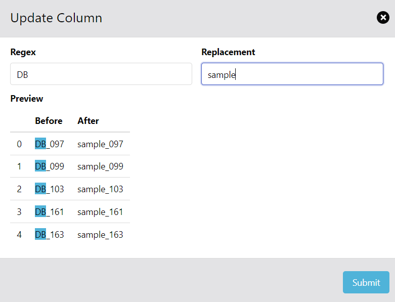

---

## New process, new worksheet

1. Add a new sheet to the `assays/rnaseq/isa.assay.xlsx` workbook.
2. Add the template "RNASeq Assay"

---

## Exercise :pencil:

Try to fill the two sheets with the protocol details:
  - `assays/rnaseq/protocols/RNA_extraction.txt` and
  - `assays/rnaseq/protocols/Illumina_libraries.txt`

---

## Link samples across studies and assays

1. Use the `Output [Sample Name]` of studies/talinum_drought/isa.study.xlsx as the `Input [Sample Name]` to **rna-extraction**.
1. Use the `Output [Sample Name]` of **rna-extraction** as the `Input [Sample Name]` to **illumina-libraries**.

**Seeds** &mdash;*Plant growth*&#x21FE; **Leaves** &mdash;*RNA Extraction*&#x21FE; **RNA** &mdash;*Illumina*&#x21FE; **fastq files**


---

## Link dataset files to samples

1. In the *Building Blocks* widget select *Output* -> *Raw Data File*.
2. Click <kbd>Add Column</kbd>.

:bulb: You see a warning about a changed output column.

3. Click <kbd>Continue</kbd>.
4. Go to the *File Picker* tab and click <kbd>Pick file names</kbd>.
5. Select and open the *fastq.gz files from the dataset folder.
6. Copy / paste them to the `Raw Data File`. 

:bulb: This allows you to link your samples to the resulting raw data files.

---

## Your ISA table is ready üéâ

Go ahead, adjust the *Building Blocks* you want to use to describe your experiment as you see fit.
Insert values using Swate Term search and add input and output.

---

---


# Contributors

<style scoped> section{font-size:20px}</style>

If not referenced otherwise, figures and slides presented here were created by members of DataPLANT (https://nfdi4plants.org).
Additional slides were contributed by

- name: Dominik Brilhaus
  github: https://github.com/brilator
  orcid: https://orcid.org/0000-0001-9021-3197
- name: Cristina Martins Rodrigues
  github: https://github.com/CMR248
  orcid: https://orcid.org/0000-0002-4849-1537
- name: Kevin Frey
  github: https://github.com/Freymaurer
  orcid: https://orcid.org/0000-0002-8493-1077
- name: Sabrina Zander
  orcid: https://orcid.org/0009-0000-4569-6126
- name: Martin Kuhl
  github: https://github.com/Martin-Kuhl
  orcid: https://orcid.org/0000-0002-8493-1077
