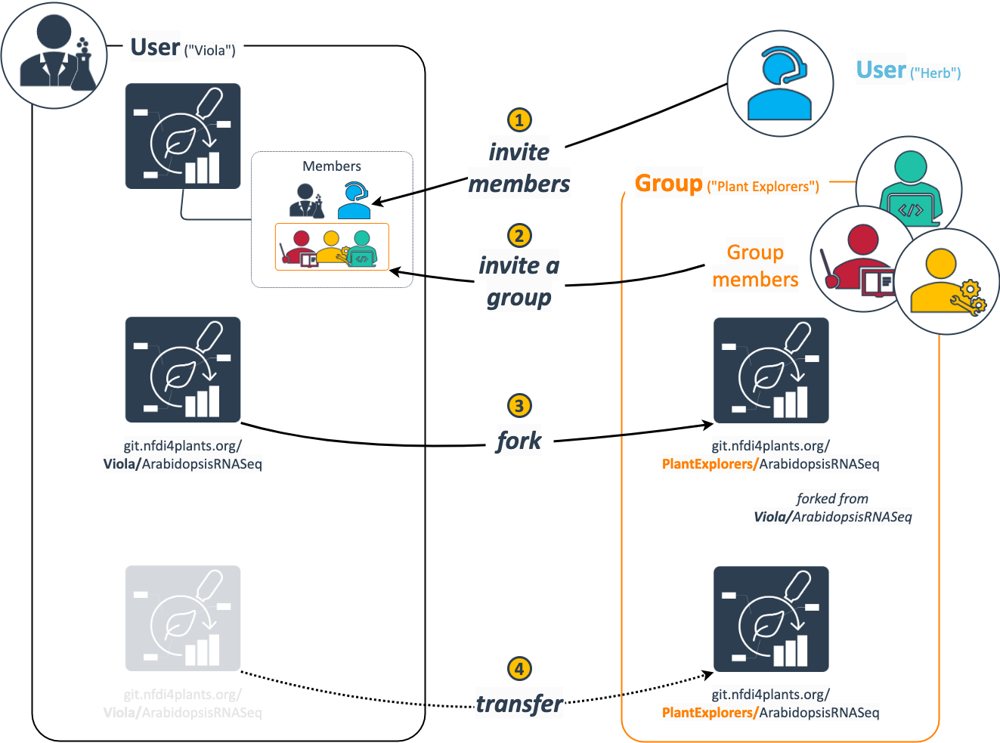
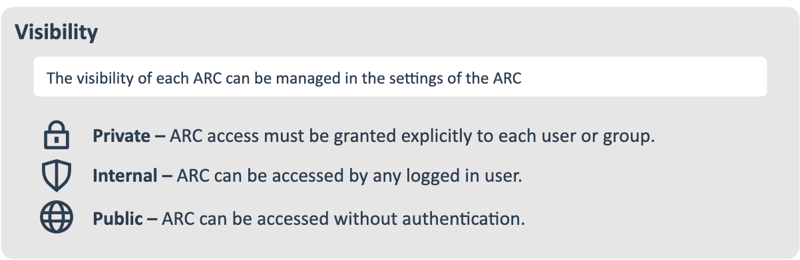
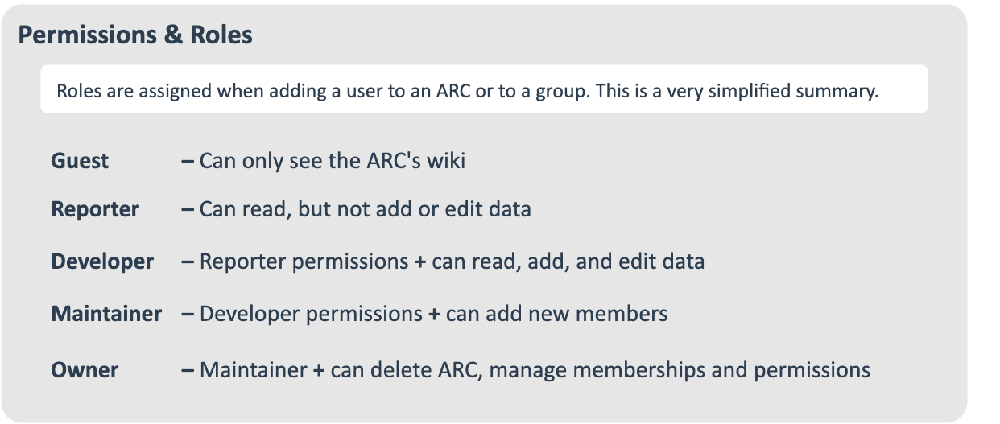
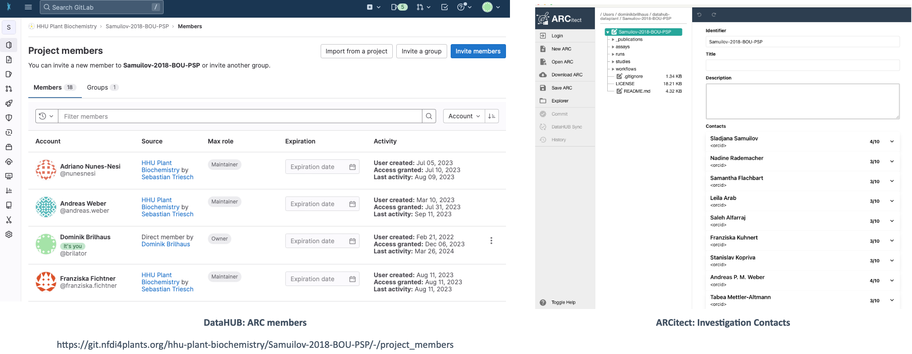

# DataHUB concepts and terminology

---

<!-- TODO 

# Terminology

- commit
- repository / repo
- push / pull
- branch / fork

# add comparison GitLab vs. Cloud Services

---
-->

# Where do I store my ARC?

---

# ARC storage and sharing

- DataHUB as "ground truth" / original clone
- You can sync and communicate all changes to your ARC via the DataHUB

 :bulb: ARCitect and ARC commander provide options to avoid syncing large files (LFS = Large file storage) 

---

# Example setup to store and use ARCs

  

  
  ### Personal computer

  - work on small files
  - annotate metadata
  - add scripts, protocols
  
  ### Workstation / Server

  - work on large files
  - run computations
  
  

  

  ### FileShare
  
  - mount to local machine, sync ARC from there
  
  ### HPC

  - direct connection HPC to DataHUB (depends on security settings)
  - or mount to local machine and sync, ARC from there
  
  
  

---

# **Projects** and **Groups** are not the same

- "Project" = ARC
- "Groups" = Group of users

---

## Project = ARC

- In the DataHUB, ARCs are called "projects"; they are the same.
- An ARC can be shared with individual users (invited as "members") or a group.

---

## DataHUB Groups

- A "Group" is a group of users with specific [permissions](#roles-and-permissions)
- A group can share ARCs
- A group can be invited to an ARC
- Groups can have subgroups

---

# Options to share an ARC via the DataHUB

---

# Namespaces

- Every user has a personal namespace, where they can upload or create new ARCs
- Every group and subgroup has its own namespace

Type | URL | Namespace | Name
--- | --- | --- | --- 
A **personal** ARC | https://git.nfdi4plants.org/brilator/Facultative-CAM-in-Talinum | `brilator` | Dominik Brilhaus
An **group**-shared ARC | https://git.nfdi4plants.org/hhu-plant-biochemistry/Samuilov-2018-BOU-PSP | `hhu-plant-biochemistry` | HHU Plant Biochemistry

:bulb: **Personal** is not the same as **private**

---

# Visibility

The visibility of ARCs and groups can be managed individually for each ARC or group
  

:bulb: By default every ARC and every group is set to **private**.

---

# Permissions & Roles

When inviting new members to an ARC or group, you can choose between different levels.

:bulb: By default you are **Owner** of an ARC you create or upload to the DataHUB.

---

# ARC DataHUB members // ARC Investigation contacts <!-- fit -->

:bulb: Investigation contacts are not automatically invited as members to the ARC.
