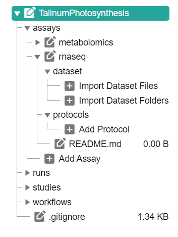

## ARCitect Hands-on

<!-- _paginate: false -->

---

## ARCitect installation

Please install version **v0.0.48** (or later) of the ARCitect: https://github.com/nfdi4plants/ARCitect/releases/latest

---

## Download the demo data

https://uni-duesseldorf.sciebo.de/s/C7ms3QA6q7OZnU2 

<!--  -->

---

## A small prototypic project

---

## ARC: Annotated research context

---

## The ARC scaffold structure

---

## Sort Demo data in an ARC <!-- fit -->

---

## Open ARCitect

1. Login to DataHUB (1)
   
2. Select `git.nfdi4plants.org` as Host 
    
---

## Initiate the ARC folder structure

1. Create a **New ARC** (2)
2. Select a location and name it **TalinumPhotosynthesis**

---

## Your ARC's name

💡 By default, your ARC's name will be used
   - for the ARC folder on your machine
   - to create your ARC in the DataHUB at `https://git.nfdi4plants.org/<YourUserName>/<YourARC>` (see next steps)
   - as the identifier for your investigation

💡 Make sure that no ARC exists at  `https://git.nfdi4plants.org/<YourUserName>/<YourARC>`. Otherwise you will sync to that ARC.

---

## Add a description to your investigation

---

## Add contributors

- you could also add the contacts directly via ORCID

---

## Divide and conquer for reproducibility

---

## Identifying the ‘study’ part

---

## Add a study

by clicking "Add Study" and entering an identifier for your study

Use **talinum_drought** as an identifier

---

## Study panel

In the study panel you can add

- general metadata,
- people, and
- publications
- data process information

---

## Add protocols

You can either
- directly write a **new protocol** within the ARCitect or
- import an existing one from your computer

---

## Add an assay

by clicking "Add Assay" and entering an identifier for your assay

Add two assays with **rnaseq** and **metabolomics** as an identifier

---

## Add information about your assay

In the assay panel you can define the assay's
 - measurement type
 - technology type, and
 - technology platform

---

## Explorer

The **Explorer (6)** button directly opens your ARC locally

---

## Commit panel (7)

You have to commit changes before you can upload to the DataHUB

---
If you are logged in, the **Commit panel** shows
- your DataHUB's *Full Name* and *eMail*

It allows you to
- track changes of the ARC with git
- add a commit message 
- use different branches 

---
## History panel (9)

In the History panel you can inspect your ARCs history with all commits 

---
## Upload your local ARC to the DataHUB

From the sidebar, navigate to **DataHUB Sync** (8)

---

## DataHUB Sync

The DataHUB Sync panel allows you to
- sync the changes to the DataHUB: **Push**
- sync from the DataHUB: **Pull**, and
- change the Remote for the synchronization

 

<!-- TODO more to remote?-->
---

## Check if your ARC is successfully uploaded

1. [sign in](https://auth.nfdi4plants.org/realms/dataplant/login-actions/registration?client_id=account&tab_id=4bQkU161waI) to the DataHUB 
2. Check your projects

---

## Add protocols and datasets

In the file tree you can
  - **import dataset files or folders** and 
  - **protocols** associated to that dataset.

:bulb: **Import Dataset** allows to import data from any location on your computer into the ARC.

:warning: Depending on the file size, this may take a while. Test this with a small batch of files first.

---

---
---

## Download the demo data

1. Open the ARCitect
2. Login (1) to your DataHUB account
3. Navigate to **Download ARC** (4)

---

## Download the demo data

4. Search for **Talinum-CAM-Photosynthesis**
5. Click the download button, select a location and open the ARC.
6. Open the downloaded ARC

:bulb: This is basically the ARC we created in the last session.

---