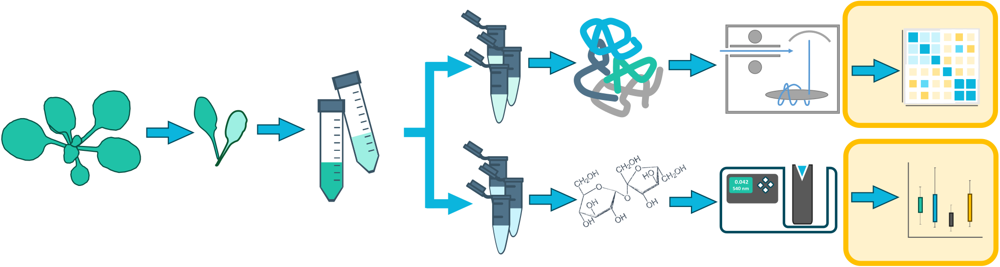
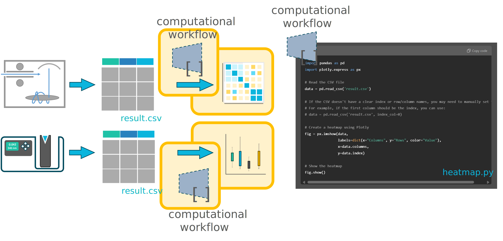
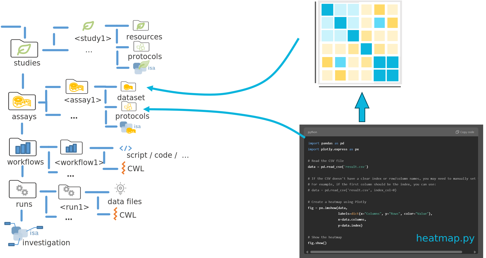
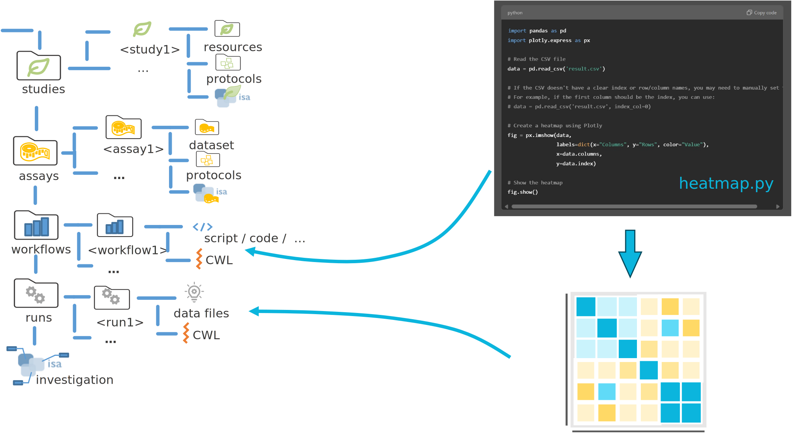
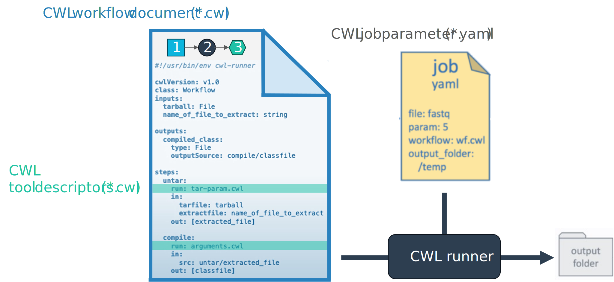
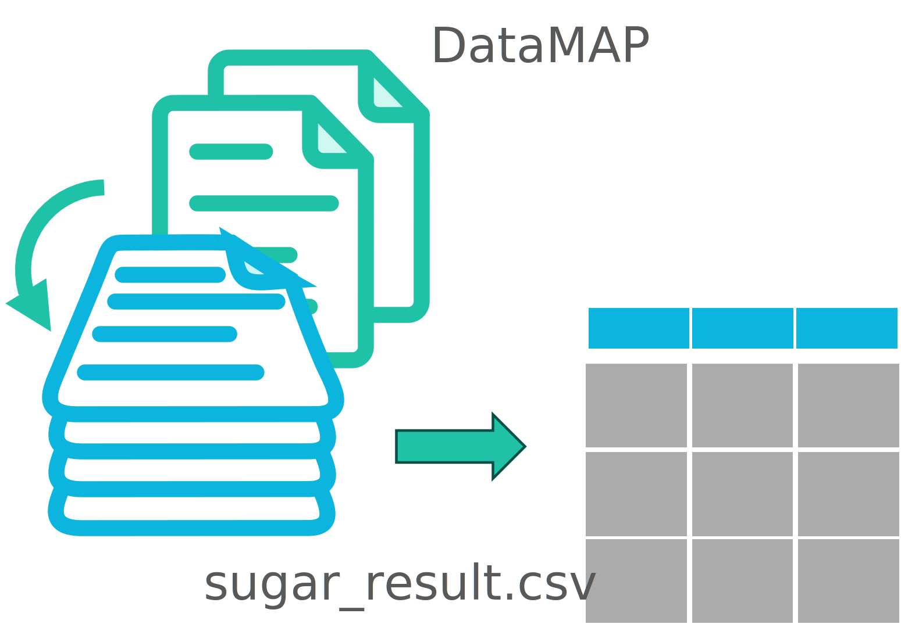
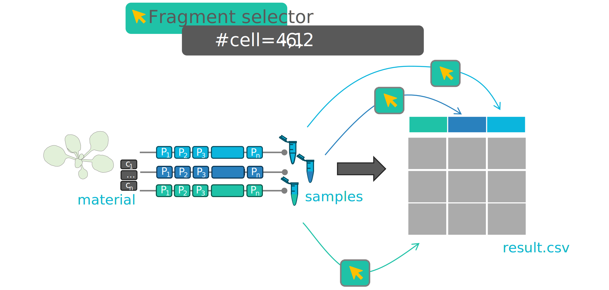
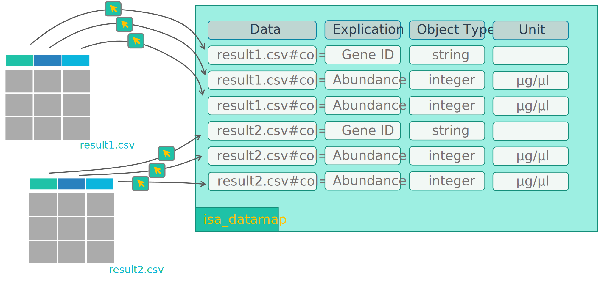

## Options to annotate the data analysis

---

## A computational workflow is like a protocol

---

## Option I: Create a virtual assay

---

## Option II: Create a workflow and run

---

## Use CWL to wrap your workflow

---

## Add datasets

In the file tree you can
  - **import dataset files or folders** and 
  - **protocols** associated to that dataset.

:bulb: **Import Dataset** allows to import data from any location on your computer into the ARC.

:warning: Depending on the file size, this may take a while. Test this with a small batch of files first.

---
---

# Backup Slides

---

## Download the demo data

1. Open the ARCitect
2. Login (1) to your DataHUB account
3. Navigate to **Download ARC** (4)

---

## Download the demo data

4. Search for **Talinum-CAM-Photosynthesis**
5. Click the download button, select a location and open the ARC.
6. Open the downloaded ARC

:bulb: This is basically the ARC we created in the last session.

---

---

---

## Annotation of the result data points

Persistence from sample to data point using fragment selectors

---

## Point into results - Fragment selectors

---

## DataMAP: Annotation for the fragment selectors

