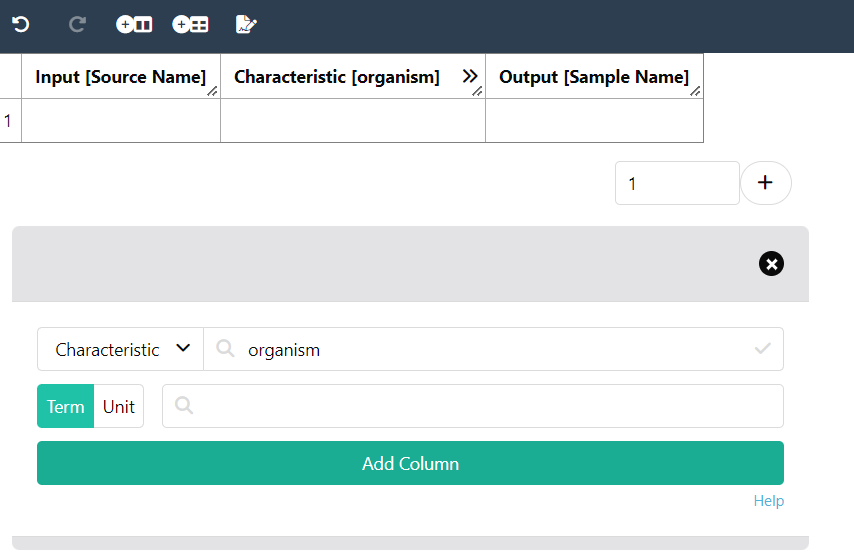
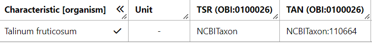

##  Let's annotate the plant samples first

1. Check out the lab notes `studies/talinum_drought/protocols/plant_material.txt`
2. Select the study `talinum_drought`
3. Add a new table sheet at the bottom

---

## Create an annotation table

Create a Swate annotation table by adding **Building blocks** via the widget (A) or the sidebar (B)

:bulb: Each table can contain only one *Input* and one *Output* column  

:bulb: different *Input* and *Output* options: `Source Name`, `Sample Name`, `Material`, `Raw Data File`, `Derived Data File`, `Image File`

---

## Add more Building blocks

1. Add an *Input* (`Source Name`) and *Output* (`Sample Name`) column
2. Select *Characteristic* from the drop-down menu
3. Enter `organism` in the search bar. This search looks for suitable *Terms* in our *Ontology* database.
4. Select the Term with the id `OBI:0100026` and, 
5. Click Add Column

:bulb: This adds four columns to your table, one visible and **three** hidden.

---

## Insert values to annotate your data

1. Insert values by selecting any cell below `Characteristic [organism]`
2. Use free text or use the magnifying glass to activate *Term* search
3. Write "Talinum fruticosum" and enable *Term* search
4. Select the hit 

---

## Add a Building block with a unit

1. In the *Building Blocks* widget, select *Parameter*, search for `light intensity exposure` and select the term with id `PECO:0007224`.
2. Check the box for *Unit* and search for `microeinstein per square meter per second` in the adjacent search bar.
3. Select `UO:0000160`.
4. Click Add Column.

:bulb: This also adds four columns to your table, one visible and **three** hidden.

---

## Insert unit-values to annotate your data

In the annotation table, select any cell below `Parameter [light intensity exposure]` and add "425" as light intensity.

:bulb: You can see the numbers being complemented with the chosen unit, e.g. `425 microeinstein per square meter per second`

---

## Showing ontology reference columns

Use double pointed quotation mark to un-hide hidden columns. 

:bulb: You can see that your organism of choice was added with id and source Ontology in the reference (hidden) columns.

---

## Your ISA table is growing

At this point. Your table should look similar to this:

---

## Exercise :pencil:

Try to add suitable *Building Blocks* for other pieces of metadata from the plant growth protocol (`studies/talinum_drought/protocols/plant_material.txt`).

---

## Add a factor building block

1. In the *Building Blocks* widget, select *Factor*, search for `watering exposure` and select the term with id `PECO:0007383`.
2. Click <kbd>Add Column</kbd>.
3. Add the drought treatment ("no water for 12 days", "re-water for 2 days") to the respective samples

:bulb: There are different options to add the drought treatment.

---

## Link the protocol to the isa table

1. In the *Building Blocks* tab, select *More* -> *Protocol REF*.
2. Click <kbd>Add Column</kbd>.
3. Add the name of the protocol file (plant_material.txt) to the *Protocol REF* column.

:bulb: This allows you to reference the free-text, human-readable protocol.

---

## Fill out source name and sample name

Transfer the sample ids from the protocol.

1. Invent names for `Source Name` (we do not have this information)
2. Use the sample names (DB_*) as `Sample Name`

---

## Let's annotate the RNA Seq data

1. Navigate to the demo ARC. 
2. Open the lab notes `assays/rnaseq/protocols/RNA_extraction.txt` in a text editor.
3. Import the empty `assays/rnaseq/isa.assay.xlsx` workbook in Swate.

---

## Use a template

1. Open the *Templates* widget in the Bar 

:bulb: Here you can find DataPLANT and community created workflow annotation templates

1. Search for `RNA extraction` and click <kbd>select</kbd> 
    - You will see a preview of all *Building Blocks* which are part of this template.
2. Click <kbd>Add template</kbd> to add all *Building Blocks* from the template to your table, which <u>do not exist yet</u>.

---

## Remove Building blocks

If there are any *Building Blocks* which do not fit to your experiment you can use right click --> "Delete Column" to remove it including all related (hidden) reference columns.

---

## Move Building blocks
If the order of the *Building Blocks* should be adjusted you can use right click --> "Move Column"

---

## Replace multiple names 

Right click --> "Update Column" can be used to replace names in batches
:bulb: this only works on Input columns

---

## New process, new worksheet

1. Add a new sheet to the `assays/rnaseq/isa.assay.xlsx` workbook.
2. Add the template "RNASeq Assay"

---

## Exercise :pencil:

Try to fill the two sheets with the protocol details:
  - `assays/rnaseq/protocols/RNA_extraction.txt` and
  - `assays/rnaseq/protocols/Illumina_libraries.txt`

---

## Link samples across studies and assays

1. Use the `Output [Sample Name]` of studies/talinum_drought/isa.study.xlsx as the `Input [Sample Name]` to **rna-extraction**.
1. Use the `Output [Sample Name]` of **rna-extraction** as the `Input [Sample Name]` to **illumina-libraries**.

**Seeds** &mdash;*Plant growth*&#x21FE; **Leaves** &mdash;*RNA Extraction*&#x21FE; **RNA** &mdash;*Illumina*&#x21FE; **fastq files**

---

## Link dataset files to samples

1. In the *Building Blocks* widget select *Output* -> *Raw Data File*.
2. Click <kbd>Add Column</kbd>.

:bulb: You see a warning about a changed output column.

3. Click <kbd>Continue</kbd>.
4. Go to the *File Picker* tab and click <kbd>Pick file names</kbd>.
5. Select and open the *fastq.gz files from the dataset folder.
6. Copy / paste them to the `Raw Data File`. 

:bulb: This allows you to link your samples to the resulting raw data files.

