## 

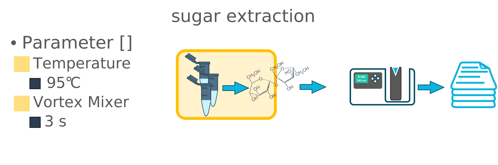

---

## 

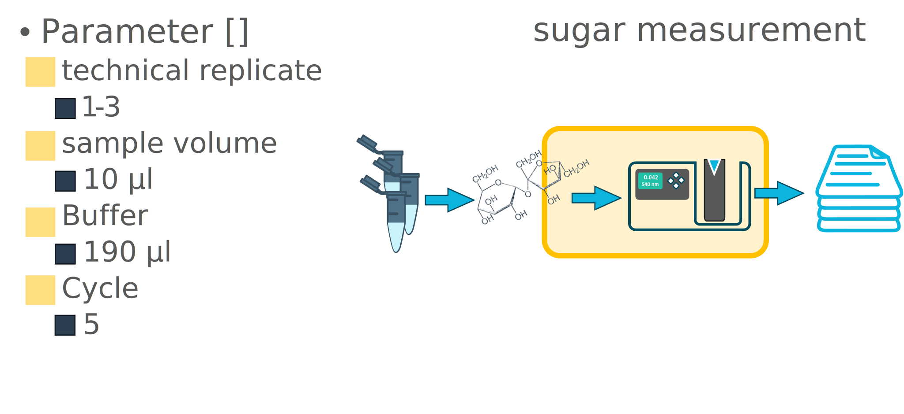

---

## 

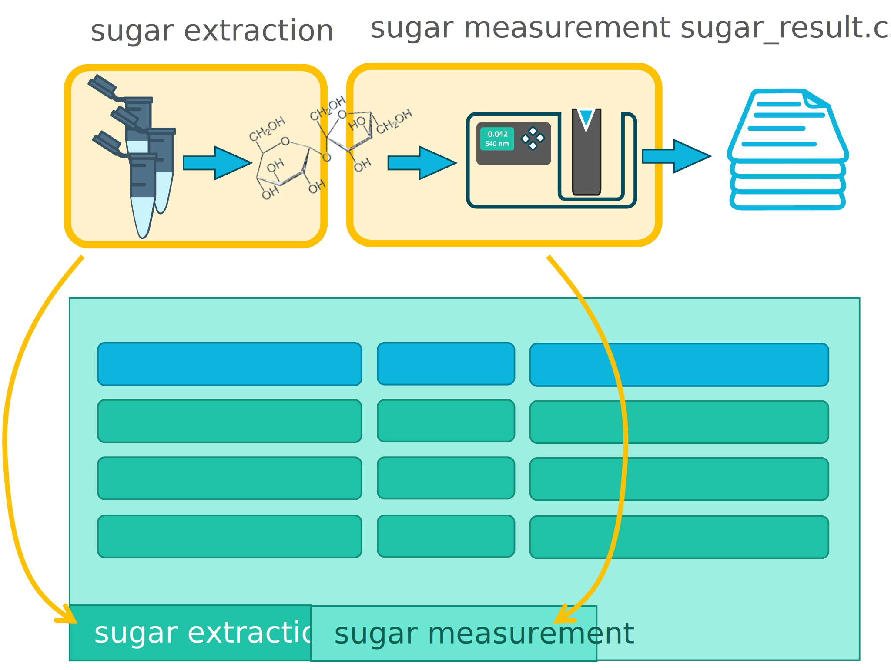

---

## 

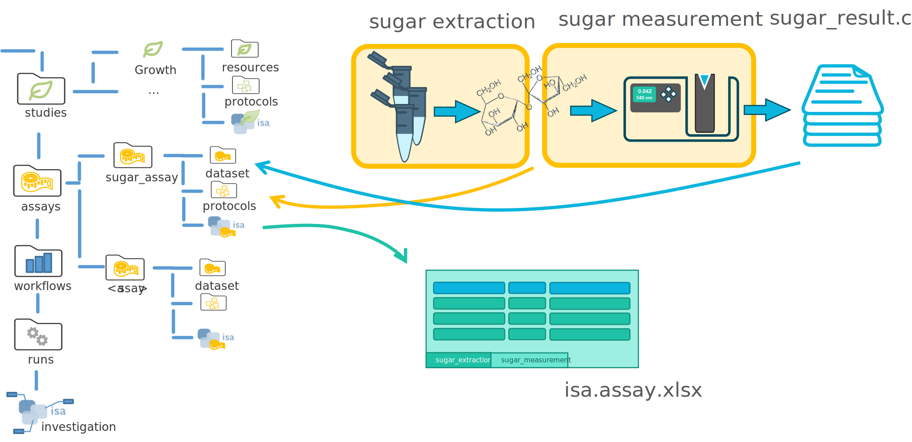

---

## 

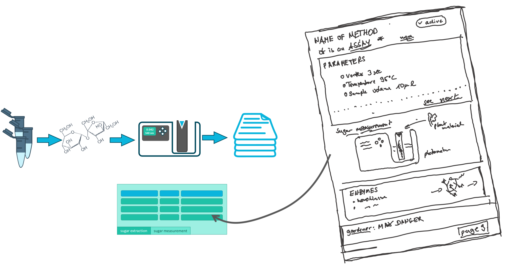

---

## 

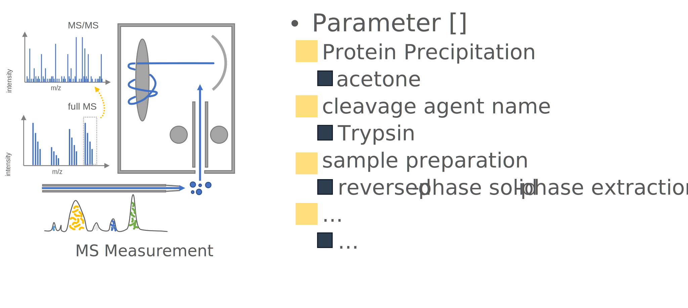

---

## 

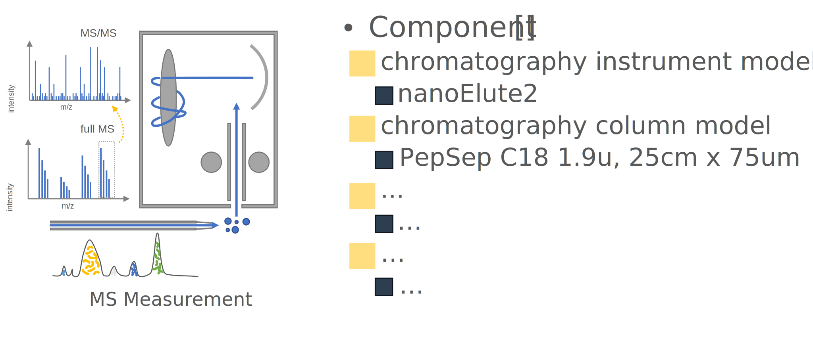

---

## 

---

## 

---

## 

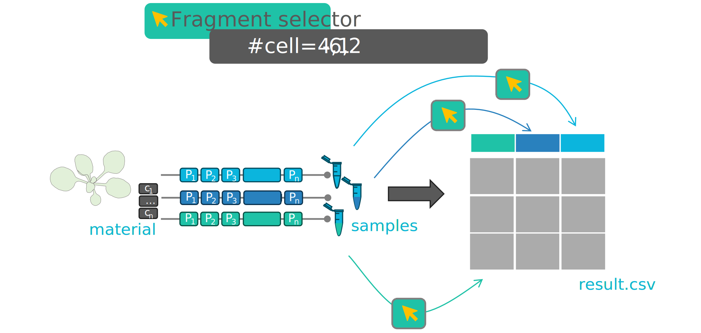

---

## 

---

## 

---

## 

---

## 

---

## 

---

## 

---

## 

---

## 

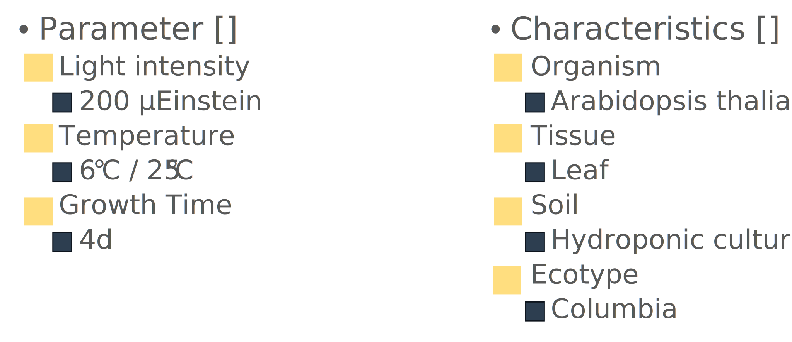

---

## 

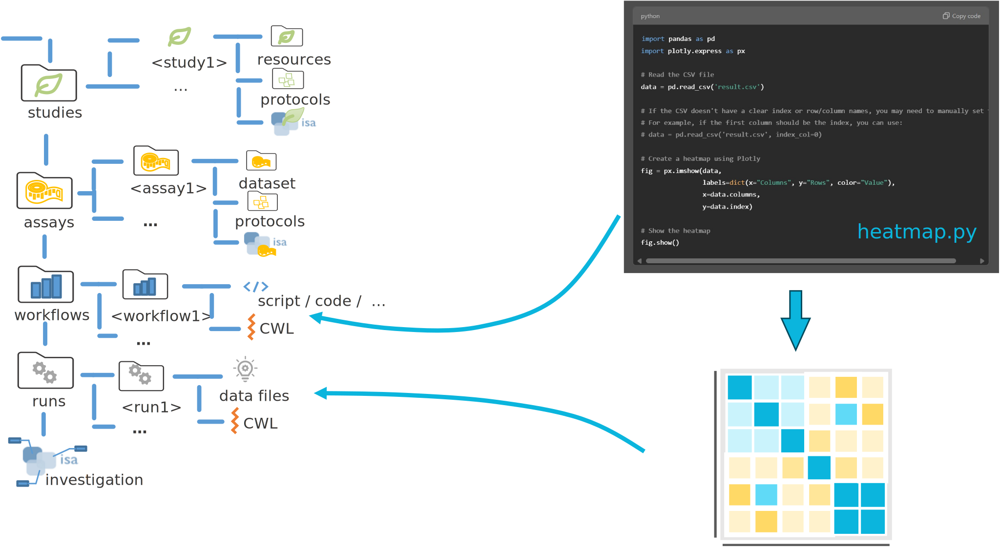

---

## 

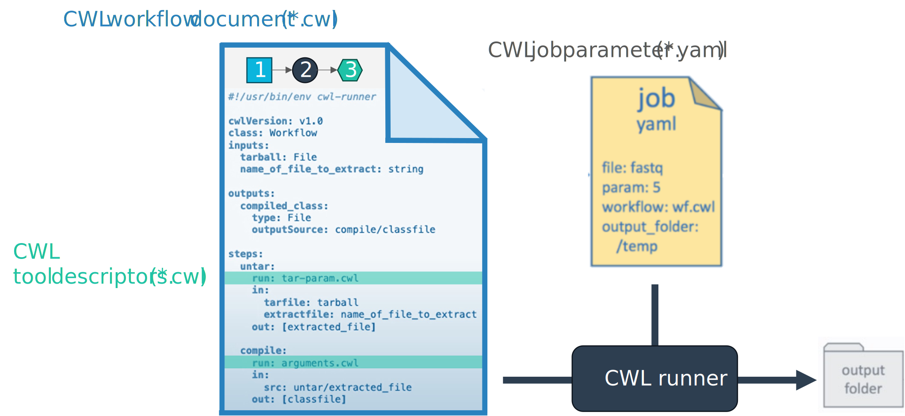

---

## 

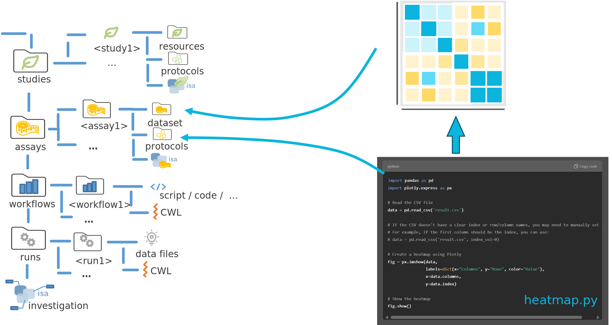

---

## 

---

## 

---

## 

---

## 

---

## 

 [alt text](<DataPLANT - workshop active.pptx>)

---

## 

