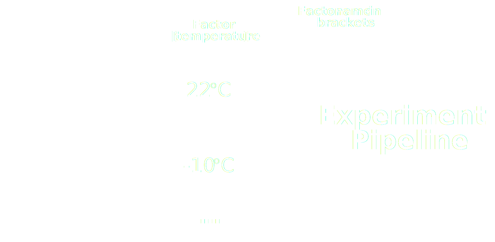

# Source Name

Every annotation table must start with the Source Name column, which defines the input of your table. This input value must be a unique identifier for an organism or a sample.  
The number of Source Name columns per table is limited to one.

---

# Characteristics

Characteristic columns describe inherent properties of the source material, e.g., a certain strain or ecotype, but also the temperature an organism was exposed to.  
You can use any number of Characteristic columns.

---

# Factor

Use Factor columns to describe independent variables that determine the specific output of your experiment when process and analysis were identical.  
Most of the time, Factors are the most important building blocks for downstream computational analysis.

---

# Parameter

Parameter columns describe steps in your experimental workflow, e.g., the temperature or extraction buffer used for your assay. Multiple Parameter columns form a protocol.  
You can use any number of Parameter columns.

---

# Component

Use these columns to list anything physical of a protocol that can be consumed, e.g. instrument names, software names, or reagents names.  
You can use any number of Component columns.

---

# Protocol Columns

Use Protocol REF columns to reference the protocol used in this table, i.e., the name of the protocol. Protocol Type columns define the type according to your preferred public repository, e.g., a growth protocol.  
The number of columns for each subtype is limited to one per table.

---

# Output Columns

Per table only one output column is allowed, which can either be a Sample Name, a Raw Data File or a Derived Data File. Data files can be sources for computational workflows.  
The value of this column must be a unique identifier.

 