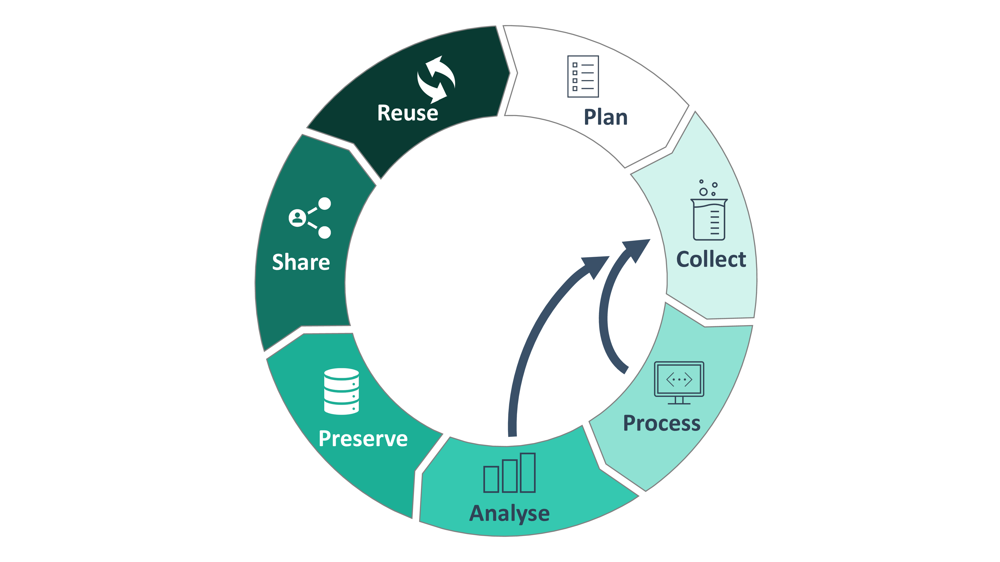

# The Research Data Lifecycle

<figure>
  
  <figcaption>inspired by RDMkit   https://rdmkit.elixir-europe.org/data_life_cycle</figcaption>
</figure>

<!-- Source to slide(s) -->
<!-- ../../bricks/ResearchDataLifecycle01-Plan.md -->

---

# The Research Data Lifecycle

<figure>
  
  <figcaption>inspired by RDMkit   https://rdmkit.elixir-europe.org/data_life_cycle</figcaption>
</figure>

<!-- Source to slide(s) -->
<!-- ../../bricks/ResearchDataLifecycle02-Collect.md -->

---

# The Research Data Lifecycle

<figure>
  
  <figcaption>inspired by RDMkit   https://rdmkit.elixir-europe.org/data_life_cycle</figcaption>
</figure>

<!-- Source to slide(s) -->
<!-- ../../bricks/ResearchDataLifecycle03-Process.md -->

---

# The Research Data Lifecycle

<figure>
  
  <figcaption>inspired by RDMkit   https://rdmkit.elixir-europe.org/data_life_cycle</figcaption>
</figure>

<!-- Source to slide(s) -->
<!-- ../../bricks/ResearchDataLifecycle04-Analyse.md -->

---

# The Research Data Lifecycle

<figure>
  
  <figcaption>inspired by RDMkit   https://rdmkit.elixir-europe.org/data_life_cycle</figcaption>
</figure>

<!-- Source to slide(s) -->
<!-- ../../bricks/ResearchDataLifecycle05-Preserve.md -->

---

# The Research Data Lifecycle

<figure>
  
  <figcaption>inspired by RDMkit   https://rdmkit.elixir-europe.org/data_life_cycle</figcaption>
</figure>

<!-- Source to slide(s) -->
<!-- ../../bricks/ResearchDataLifecycle06-Share.md -->

---

# The Research Data Lifecycle

<figure>
  
  <figcaption>inspired by RDMkit   https://rdmkit.elixir-europe.org/data_life_cycle</figcaption>
</figure>

<!-- Source to slide(s) -->
<!-- ../../bricks/ResearchDataLifecycle07-Reuse.md -->

---

# The Research Data Lifecycle

<figure>
  
  <figcaption>inspired by RDMkit   https://rdmkit.elixir-europe.org/data_life_cycle</figcaption>
</figure>

<!-- Source to slide(s) -->
<!-- ../../bricks/ResearchDataLifecycle08-Loops.md -->

---

# The Research Data Lifecycle

<figure>
  
  <figcaption>inspired by RDMkit   https://rdmkit.elixir-europe.org/data_life_cycle</figcaption>
</figure>

<!-- Source to slide(s) -->
<!-- ../../bricks/ResearchDataLifecycle09-Cross.md -->
