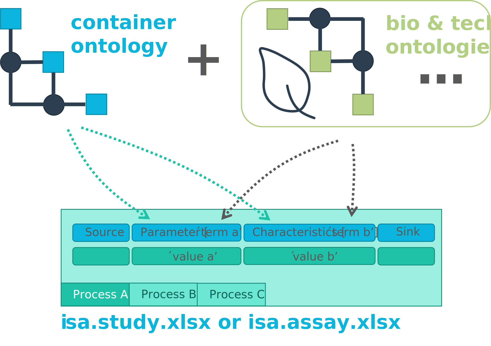

# Swate workflow annotation tool for Excel

<!-- Source to slide(s) -->
<!-- ../../bricks/lesson_Swate_DataPLANT-Swate_workflow_annotation_tool_for_Excel.md -->

---

# Annotation by flattening the knowledge graph

- Low-friction metadata annotation
- Familiar spreadsheet, row/column-based environment

<!-- Source to slide(s) -->
<!-- ../../bricks/lesson_Swate_DataPLANT-Annotation_by_flattening_the_knowledge_graph.md -->

---

# Annotation principle

<!--  -->

- Low-friction metadata annotation
- Familiar spreadsheet, row/column-based environment

<!-- Source to slide(s) -->
<!-- ../../bricks/lesson_Swate_DataPLANT-Annotation_principle.md -->

---

# Adding new building blocks (columns)

- Swate can be used for the annotation of **isa.study.xlsx and isa.assay.xlsx** files

<!-- Source to slide(s) -->
<!-- ../../bricks/lesson_Swate_DataPLANT-Adding_new_building_blocks.md -->

---

# Annotation Building Block types <!--fit-->

- Source Name (Input)
- Protocol Columns
  - Protocol Type, Protocol Ref
- Characteristic
- Parameter
- Factor
- Component
- Output Columns
  - Sample Name, Raw Data File, Derived Data File

<!-- Source to slide(s) -->
<!-- ../../bricks/lesson_Swate_DataPLANT-Annotation_Building_Block_types.md -->

---

# Ontology term search

Enable **related term directed search** to directly fill cells with child terms

<!-- Source to slide(s) -->
<!-- ../../bricks/lesson_Swate_DataPLANT-Ontology_term_search.md -->

---

# Fill your table with ontology terms

<!-- Source to slide(s) -->
<!-- ../../bricks/lesson_Swate_DataPLANT-Fill_your_table_with_ontology_terms.md -->

---

# Hierarchical combination of ontologies

<!-- combination of ISA (Characteristics, Parameter, Factor) and a biological or technological ontology (e.g. temperature, strain, instrument model) gives the flexibility to display an ontology term, e.g. temperature, as a regular process parameter or as the factor your study is based on (Parameter \[temperature\] or Factor \[temperature\]). -->

<!-- Source to slide(s) -->
<!-- ../../bricks/lesson_Swate_DataPLANT-Hierarchical_combination_of_ontologies.md -->
