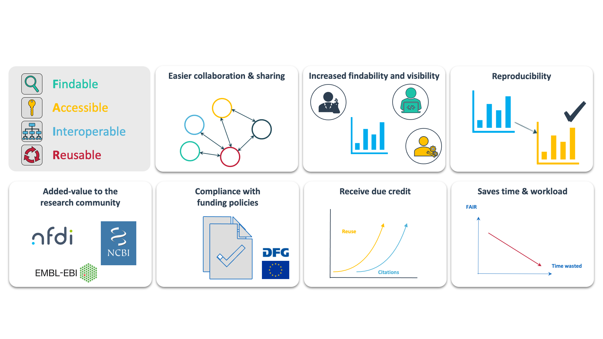

---
# Slide-related yaml
marp: true
theme: dataplant_marp-theme
paginate: true
headingDivider: 
  - 1
  - 2
footer: ' '
style: 'footer {height: 30px; padding: 10px; bottom: 00px;} #footer-img1 {height: 30px; padding-left: 0px;} #footer-img2 {height: 20px; padding-left: 20px; opacity: 0.5;}'
# Training yaml
layout: slides
title: "FAIR principles"
suggested units:
  - Introduction to RDM
author: "Dominik Brilhaus"
author_orcid: https://orcid.org/0000-0001-9021-3197
author_github: brilator
license: "[CC-BY 4.0](https://creativecommons.org/licenses/by/4.0/)"
citation: ""
description: 
learning outcomes:
  - list the FAIR principles and name one example for each
skills:
abilities:
DataPLANT implementation: ""
exercise:
requirements: ""
target audience: ""
teaching mode: "inhale/listen"
required resources: none
keywords:
  - FAIR principles
alternative: ""
duration_minutes: "5"
links and references: ""
date: "2022-10-11"
status: ready
---

# FAIR Guiding Principles for scientific data management and stewardship

https://doi.org/10.1038/sdata.2016.18

<!-- ################# -->
<!-- Source to slide(s) -->
<!-- ../../bricks/FAIR-principles.md -->
<!-- ################# -->

# The benefits of acting FAIR

<!-- ################# -->
<!-- Source to slide(s) -->
<!-- ../../bricks/FAIR-benefits.md -->
<!-- ################# -->

