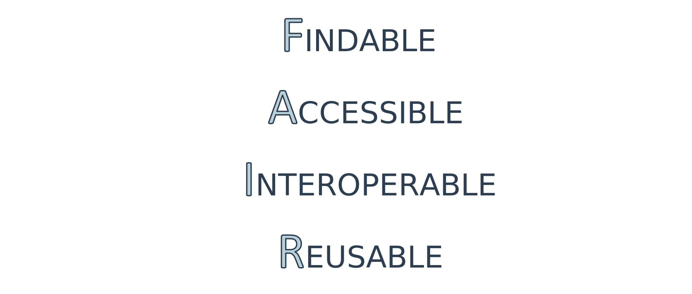
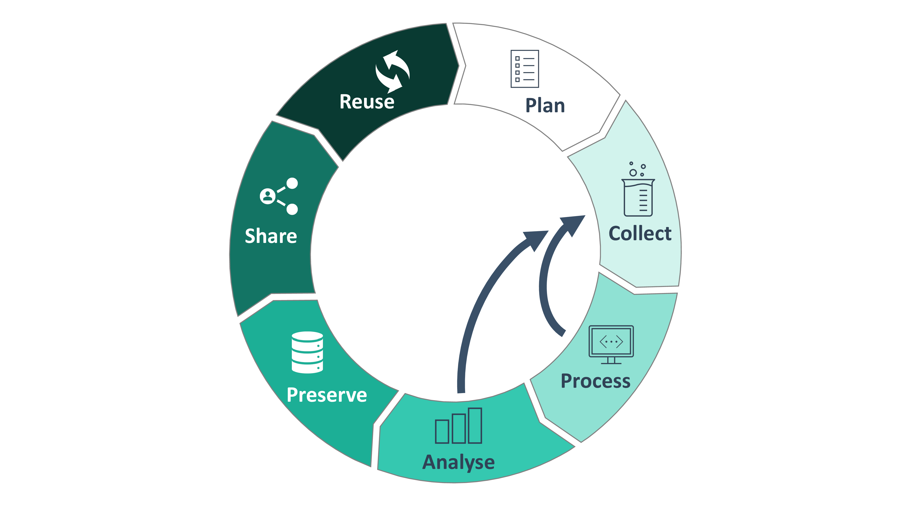

# Associate the course units to FAIR

* PID
* Repositories
* Order & Structure
* Storage  & Backup
* Version Control
* DMP
* Policies
* Metadata & Metadata Standards
* Schemata
* Documentation
* Archiving
* Ontology
* Legal Aspects & Licensing
* Data Sharing
* Access Management
* Publication

<!-- Source to slide(s) -->
<!-- ../../bricks/lesson_FAIR_outro-Associate_FAIR.md -->

---

# Associate the course units to the research data life cycle <!-- fit -->

* PID
* Repositories
* Order & Structure
* Storage  & Backup
* Version Control
* DMP
* Policies
* Metadata & Metadata Standards
* Schemata
* Documentation
* Archiving
* Ontology
* Legal Aspects & Licensing
* Data Sharing
* Access Management
* Publication

<!-- Source to slide(s) -->
<!-- ../../bricks/lesson_FAIR_outro-Associate_DataLifeCycle.md -->
