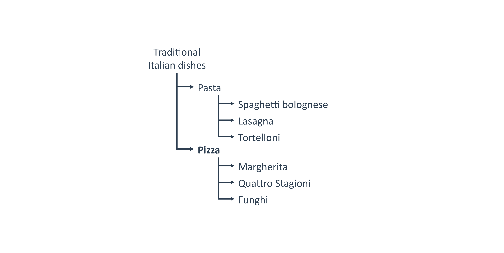
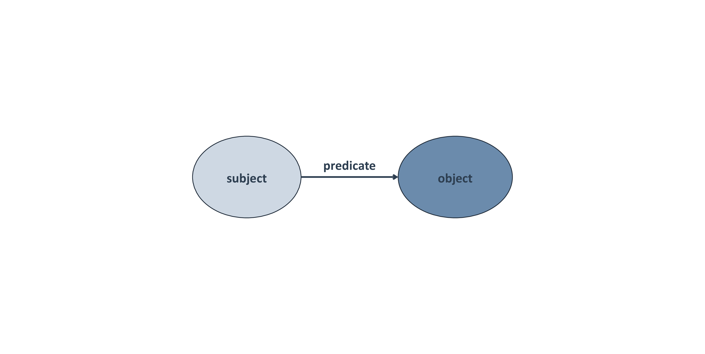
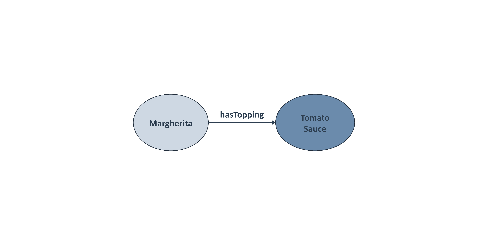
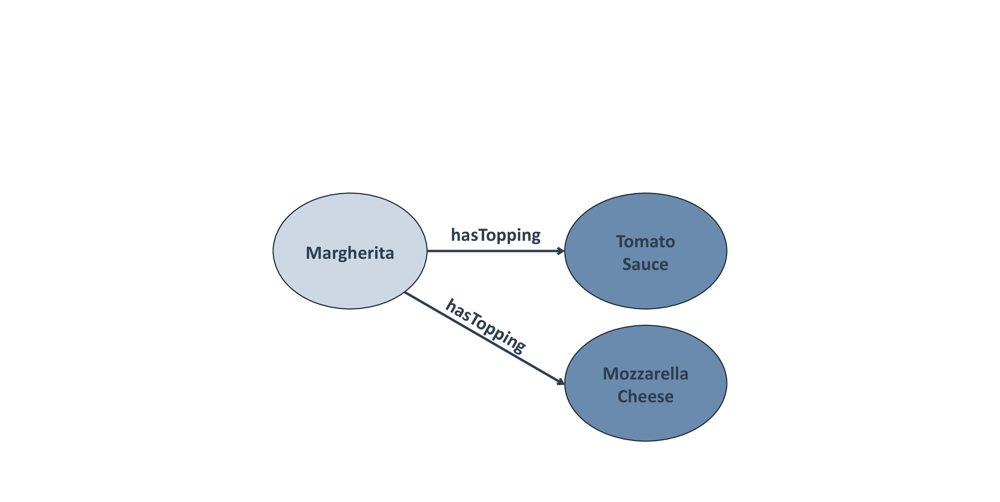
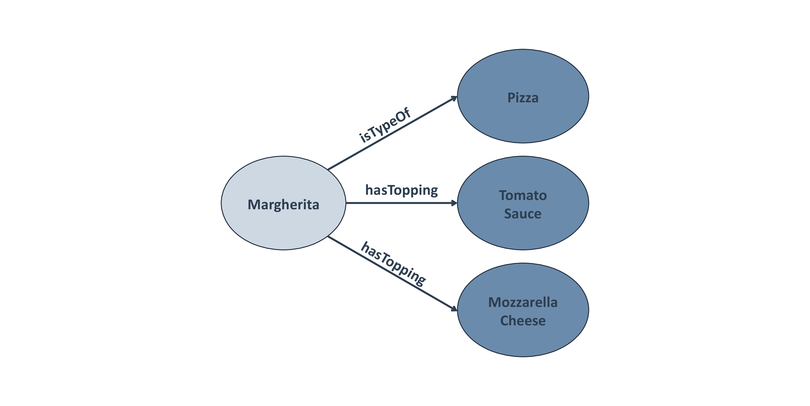
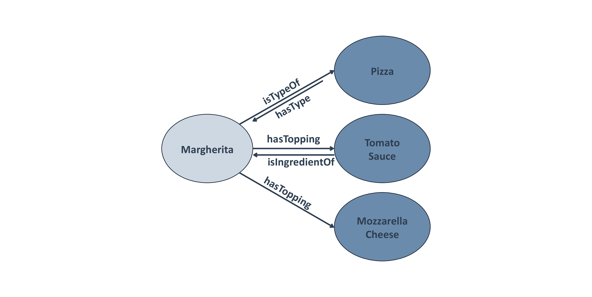
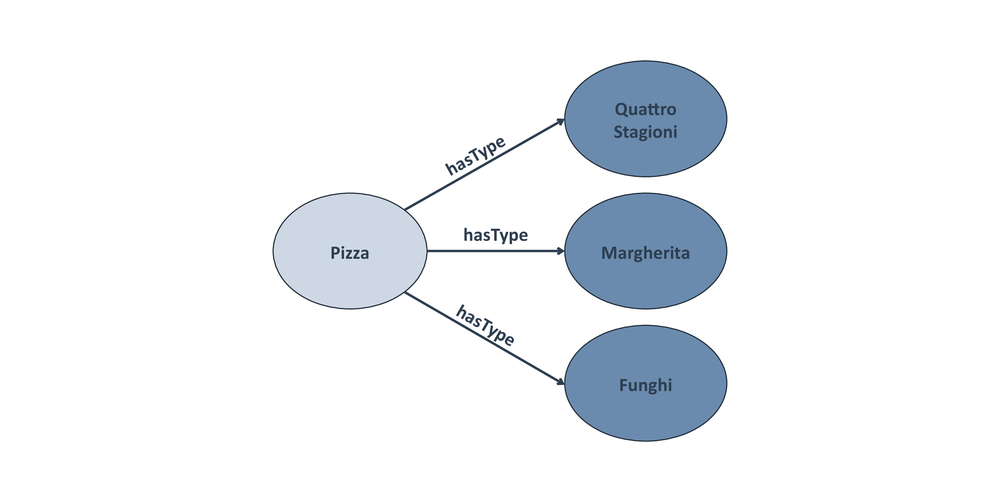
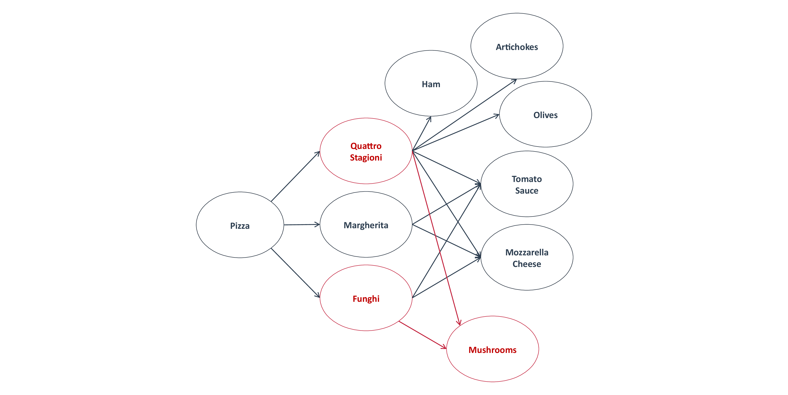

# Ontology

(Sometimes also referred to "semantic model")

An ontology combines features of

- a **dictionary**,
- a **taxonomy**, and
- a **thesaurus**

# Ontology

- Structures a set of **concepts** in a particular area and the relations between them in a **graph-like manner**
- Can be used in disambiguation, defining hierarchies, a standard to define terms
- Define a common vocabulary of concepts and their relationships to **model** a particular domain while making it **machine understandable**

<!-- Source to slide(s) -->
<!-- ../../bricks/lesson_ontology-Ontology.md -->

---

# Dictionary

Alphabetically lists terms and their definitions
 

**Pizza**: *"a dish made typically of flattened bread dough spread with a savory mixture usually including tomatoes and cheese and often other toppings and baked"*

<!-- Source to slide(s) -->
<!-- ../../bricks/lesson_ontology-Dictionary.md -->

---

# Taxonomy

Hierarchy or classification

<!-- Source to slide(s) -->
<!-- ../../bricks/lesson_ontology-Taxonomy.md -->

---

# Thesaurus

Dictionary of synonyms and relations
 

**Pizza** ≈ Lahmacun ≈ Focaccia ≈ Flammkuchen

<!-- Source to slide(s) -->
<!-- ../../bricks/lesson_ontology-Thesaurus.md -->

---

# Ontology

(Sometimes also referred to "semantic model")

An ontology combines features of

- a **dictionary**,
- a **taxonomy**, and
- a **thesaurus**

# Ontology

- Structures a set of **concepts** in a particular area and the relations between them in a **graph-like manner**
- Can be used in disambiguation, defining hierarchies, a standard to define terms
- Define a common vocabulary of concepts and their relationships to **model** a particular domain while making it **machine understandable**

<!-- Source to slide(s) -->
<!-- ../../bricks/lesson_ontology-Ontology.md -->

---

# The semantic triple

<!-- Source to slide(s) -->
<!-- ../../bricks/lesson_ontology-The_semantic_triple.md -->

---

# Modeling a pizza menu

# Modeling a pizza menu

# Modeling a pizza menu

<!-- Source to slide(s) -->
<!-- ../../bricks/lesson_ontology-Modeling_a_pizza_menu.md -->

---

# Modeling a pizza menu

# Modeling a pizza menu

# Modeling a pizza menu

<!-- Source to slide(s) -->
<!-- ../../bricks/lesson_ontology-Modeling_a_pizza_menu.md -->

---

# Modeling a pizza menu

# Modeling a pizza menu

# Modeling a pizza menu

<!-- Source to slide(s) -->
<!-- ../../bricks/lesson_ontology-Modeling_a_pizza_menu.md -->

---

# Predicates have two directions

<!-- Source to slide(s) -->
<!-- ../../bricks/lesson_ontology-Predicates_have_two_directions.md -->

---

# Looking at the menu from a different perspective

An object of one triplet can be the subject to another

<!-- Source to slide(s) -->
<!-- ../../bricks/lesson_ontology-Looking_at_the_menu.md -->

---

# (Towards) a knowledge graph

<!-- Source to slide(s) -->
<!-- ../../bricks/lesson_ontology-Towards_knowledge_graph.md -->

---

# Searching the menu

An ontology can be queried:

- *"name all pizzas with topping mushrooms"*

<!-- 
TODO: 
- This is actually not a proper ontology(!), but rather a knowledge graph (= ontology + data)
 -->

<!-- Source to slide(s) -->
<!-- ../../bricks/lesson_ontology-Searching_the_menu.md -->

---

# The Pizza Ontology

- Example from protege: https://protege.stanford.edu/ontologies/pizza/pizza.owl
- Visualize viw WebVOWL http://vowl.visualdataweb.org/webvowl.html

<!-- Source to slide(s) -->
<!-- ../../bricks/lesson_ontology-The_Pizza_Ontology.md -->

---

# Example ontologies

### EDAM ontology

- Description: http://edamontology.org/page
- Browser: https://edamontology.github.io/edam-browser

### PECO ontology

- Human-readble: https://www.ebi.ac.uk/ols/ontologies/peco
- Raw (OWL): http://purl.obolibrary.org/obo/peco.owl

> Explore more examples
> - https://www.ebi.ac.uk/ols/
> - https://bioportal.bioontology.org

<!-- 
LIVE-Demo 
- Search an "interesting" term from PECO in browser (EBI OLS)
  - Example: 
    - plant exposure
       abiotic plant exposure
          physical plant exposure
            water environment exposure
              drought environment exposure
- Show the graph view (and expand it interactively)
- Mention that terms (subjects, objects) and properties (predicates) have "URIs", "PIDs"
- Show that terms can have alternative / external IDs and link to "outdated" ontologies
-->

<!-- Source to slide(s) -->
<!-- ../../bricks/lesson_ontology-Example_ontologies.md -->
