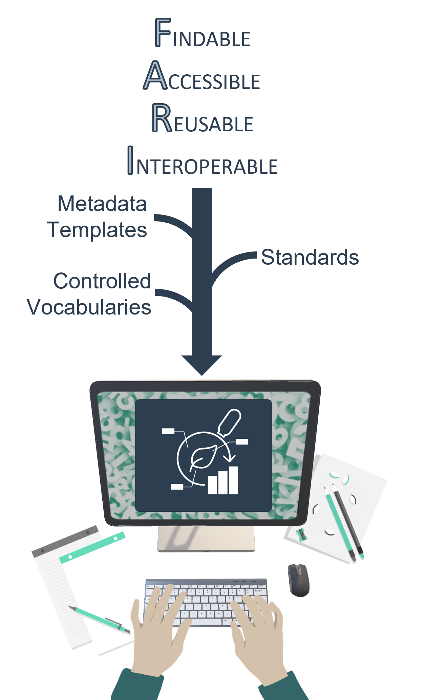
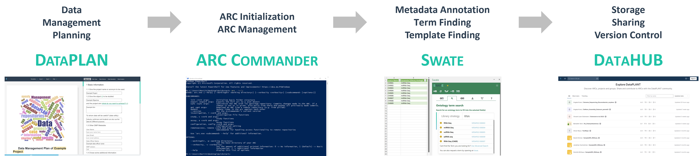
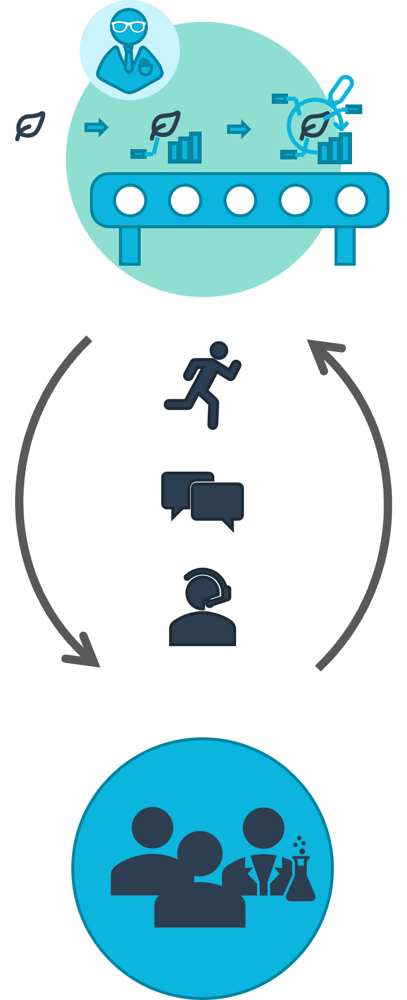

 

 

FAIR research in your hands

###

<!-- Source to slide(s) -->
<!-- ../../bricks/DataPLANT-Intro.md -->

---

# Going FAIR requires energy investment
<!-- _class: split -->

<!-- Source to slide(s) -->
<!-- ../../bricks/Going-FAIR-requires-energy-investment.md -->

---

# DataPLANT as an enzyme
<h1>

lowering the activation energy.

</h1>

 
 
 

<!-- Source to slide(s) -->
<!-- ../../bricks/DataPLANT-as-an-enzyme.md -->

---

# Annotated Research Context (ARC)
<h1>

a FAIR digital object implementation of DataPLANT

</h1>

<!-- _class: split -->

<!-- Source to slide(s) -->
<!-- ../../bricks/ARC_a-fdo-implementation-of-dataplant.md -->

---

# Tools and Services
<h1>

provide support in being FAIR

</h1>

<!-- Source to slide(s) -->
<!-- ../../bricks/DataPLANT_Tools-and-Services.md -->

---

# Let´s be FAIR together
<h1>

https://linktr.ee/DataPLANT

</h1>

<!-- _class: split -->

 
 

Helpdesk
https://helpdesk.nfdi4plants.org/

E-Mail 
info@nfdi4plants.org

Website
https://www.nfdi4plants.org/

 
 
 

<!-- Source to slide(s) -->
<!-- ../../bricks/DataPLANT-Links.md -->

---
