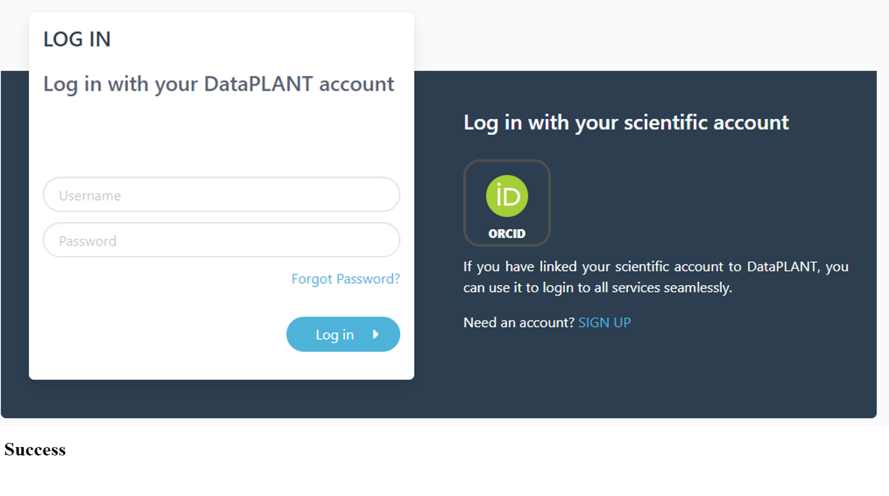

# Communicating with the DataHUB via the ARC Commander

Create and set an access token for ARC Commander synchronization using

```bash
arc remote accesstoken get -s https://git.nfdi4plants.org
```

> This authenticates your machine to communicate with your personal DataHUB account
> This step needs to be done only once per machine, unless you delete the token.

<!-- Source to slide(s) -->
<!-- ../../bricks/tutorial_arc_access.md -->


---

# ARC Commander authentication

A window within your browser will open, asking for your DataPLANT credentials. In case you are already logged in, the browser will directly display a Success message to you:



<!-- Source to slide(s) -->
<!-- ../../bricks/tutorial_arc_access-authentication.md -->
