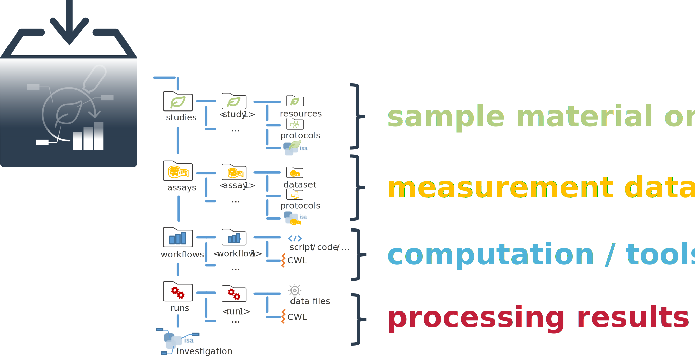

# Adding metadata to your ARC


<!-- Source to slide(s) -->
<!-- ../../bricks/tutorial_arc_add-Adding_metadata_to_your_ARC.md -->


---

# ISA investigation

The ISA investigation (`-i`) workbook allows you to record administrative metadata of your project. Add the isa.investigation.xlsx workbook including an identifier to your ARC with

```bash
arc investigation create -i QuickStartInvestigation
```

<!-- Source to slide(s) -->
<!-- ../../bricks/tutorial_arc_add-ISA_investigation.md -->


---

# ISA studies and assays

The ISA study (`-s`) and ISA assay (`-a`) workbooks allow you to annotate your experimental data.

<!-- Source to slide(s) -->
<!-- ../../bricks/tutorial_arc_add-ISA_studies_and_assays.md -->


---

# Add a study

Add an isa.study.xlsx workbook including an identifier to your ARC with

```bash
arc study add -s QuickStartStudy
```

<!-- Source to slide(s) -->
<!-- ../../bricks/tutorial_arc_add-Add_a_study.md -->


---

# Add an assay

Add an isa.assay.xlsx workbook including an identifier to your ARC with

```bash
arc assay add -s QuickStartStudy -a QuickStartAssay
```

> Note: An assay must be linked to a study. If a study does not exist, it will be created automatically in this step.

<!-- Source to slide(s) -->
<!-- ../../bricks/tutorial_arc_add-Add_an_assay.md -->


---

# subdirectories

The ARC Commander will add subdirectories to the *studies* and *assays* folder. Your ARC should look similar to this now: 


<!-- Source to slide(s) -->
<!-- ../../bricks/tutorial_arc_add-subdirectories.md -->


---

# Grow your ARC

- The previous steps can be repeated to add as many studies and assays as needed. Accordingly, more subdirectories will be added
- Multiple assays can be grouped in a study, if the same `StudyIdentifier` is used



<!-- Source to slide(s) -->
<!-- ../../bricks/tutorial_arc_add-Grow_your_ARC.md -->


---

# Add your data

Place the data and protocols for each study and assay in the respective `Dataset` and `Protocols` folders


<!-- Source to slide(s) -->
<!-- ../../bricks/tutorial_arc_add-Add_your_data.md -->
