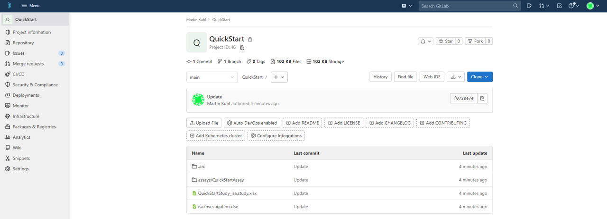

# ARC synchronization


# ARC synchronization

Whenever you update your ARC (add, edit or delete data), you can synchronize it with the DataHUB using the command

```bash
arc sync 
```

<!-- Source to slide(s) -->
<!-- ../../bricks/tutorial_arc_sync-title.md -->


---

# Create a repository on the DataHUB

Create a new blank repository on the [DataHUB](https://git.nfdi4plants.org) by clicking "New project/repository" (`+` drop down menu of the navigation bar on top).

Make sure to uncheck the box "Initialize repository with a README" in order to create a completely blank repository.

<!-- Source to slide(s) -->
<!-- ../../bricks/tutorial_arc_sync-Create.md -->


---

# Connect your local ARC to a remote ARC in the DataHUB

In order to connect your local ARC with a remote ARC, you can specify the remote address with the flag `-r` followed by the URL of the remote ARC

```bash
arc sync -r https://git.nfdi4plants.org/<OwnerOfRepository>/<NameOfRepository>
```

> This step needs to be done only once per machine and ARC.

<!-- Source to slide(s) -->
<!-- ../../bricks/tutorial_arc_sync-Connect.md -->


---

# Successful ARC synchronization

Check if the upload was successful by visiting your ARC at the respective URL in your browser.



<!-- Source to slide(s) -->
<!-- ../../bricks/tutorial_arc_sync-Success.md -->
