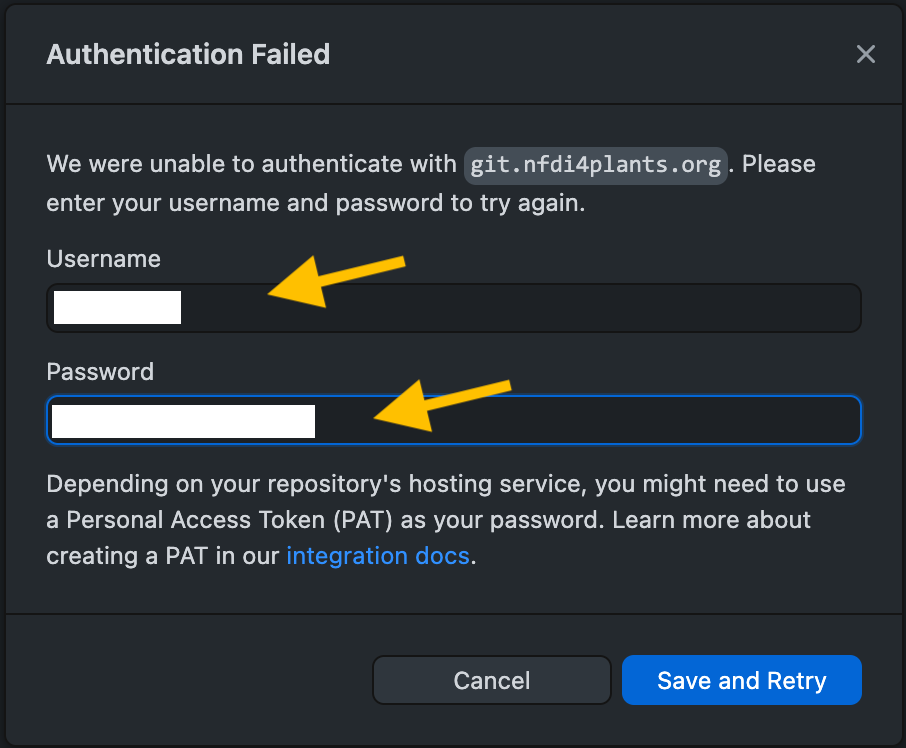

# Synchronize ARCs using GitHub Desktop

<!-- Source to slide(s) -->
<!-- ../../bricks/tutorial_datahub_GHDesktop-title.md -->

---

# About this tutorial

The recommended routine to synchronize ARCs is via the ARC Commander

You can use [GitHub Desktop](https://desktop.github.com/) to synchronize ARCs between the DataHUB and your local machine.

> Note: This authenticates your local GitHub Desktop to communicate with the DataHUB.
> You need to do this only once per machine (unless you specify an expiration date)

<!-- Source to slide(s) -->
<!-- ../../bricks/tutorial_datahub_GHDesktop-About_this_tutorial.md -->

---

# Checkpoint

For this tutorial

- You need to have a DataPLANT account granting access to the DataHUB
- You need a personal access token (PAT) to the DataHUB

<!-- Source to slide(s) -->
<!-- ../../bricks/tutorial_datahub_GHDesktop-Checkpoint.md -->

---

# GitHub Desktop

- User-friendly software to help organize your local git repositories
  - synchronize (pull, commit, push, ...)
  - track and communicate changes (diff, pull request, ...) 
- No need to memorize git commands and execute them on your command line
- Download and install [GitHub Desktop](https://desktop.github.com/)

<!-- Source to slide(s) -->
<!-- ../../bricks/tutorial_datahub_GHDesktop-GitHub_Desktop.md -->

---

# Navigate to your ARC in the DataHUB

1. Open the [DataHUB](https://git.nfdi4plants.org/)
2. Navigate to an ARC you want to sync locally
3. Click on `Clone` and copy the HTTPS url, e.g. `https://git.nfdi4plants.org/<yourUserName>/<yourArc>.git`

<!-- Source to slide(s) -->
<!-- ../../bricks/tutorial_datahub_GHDesktop-Navigate_to_your_ARC_in_the_DataHUB.md -->

---

# GitHub Desktop Clone

1. Open GitHub Desktop.
2. On top: Select `File` -> `Clone repository`
3. Select the tab `URL` on top
4. Paste the HTTPS url to your ARC inside the URL field
5. Select a destination folder (local path), where your ARC will be stored locally
6. Click `Clone`

<!-- Source to slide(s) -->
<!-- ../../bricks/tutorial_datahub_GHDesktop-GitHub_Desktop_Clone.md -->

---

# Link your account

1. A pop-up window "Authentication Failed" will ask you for Username and Password. Fill in the
    1. Username: this is your DataHUB username. You can find it under your avatar in the DataHUB
    2. Password: paste the access token generated before
2. Click `Save and Retry`
3. Your ARC is now available in your GitHub Desktop.

<!-- Source to slide(s) -->
<!-- ../../bricks/tutorial_datahub_GHDesktop-Link_your_account.md -->
