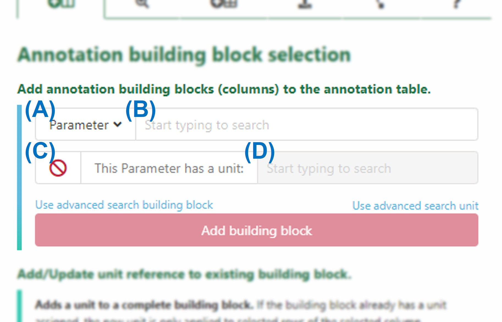
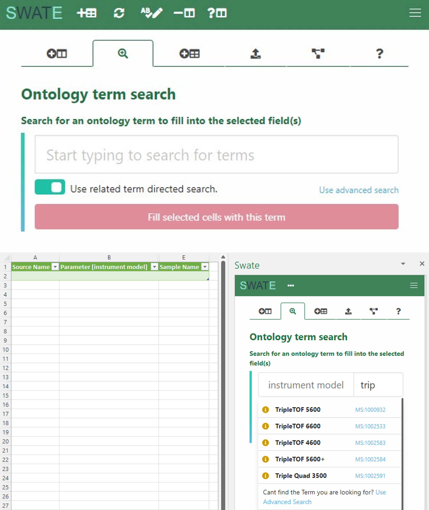

# First steps

<!-- Source to slide(s) -->
<!-- ../../bricks/tutorial_swate_firstSteps-First_steps.md -->

---

# Create a Swate table

- Click *create annotation table* in the yellow pop-up box (only appears on Excel worksheets without annotation table). 
- An annotation table with the building blocks *Source Name* and *Sample Name* will be generated.  

<!-- Source to slide(s) -->
<!-- ../../bricks/tutorial_swate_firstSteps-Create_a_Swate_table.md -->

---

# Customize your table by adding building blocks

Choose the type of building block you want to add (A).

<!-- Source to slide(s) -->
<!-- ../../bricks/tutorial_swate_firstSteps-Customize_your_table_by_adding_building_blocks.md -->

---

# Descriptive building blocks

- Use the search field (B) to search for an ontology term for a descriptive building block (Characteristics, Parameter, Factor, or Component)

> Note: Swate accesses the SwateDB with a list of established external ontologies designated suitable for use in plant science. In addition, we feature our own ontology DPBO to extend the DB with missing, but necessary terms.

<!-- Source to slide(s) -->
<!-- ../../bricks/tutorial_swate_firstSteps-Descriptive_building_blocks.md -->

---

# Units

If you want to add a building block with a unit, check box (C) and use search field (D) to look for a fitting unit term, e.g. degree Celsius as unit for Parameter \[temperature\].

<!-- Source to slide(s) -->
<!-- ../../bricks/tutorial_swate_firstSteps-Units.md -->

---

# Advanced term search

- Use the *advanced search* for building blocks and terms, if no fitting term was found.
- Use free text input, if still no fitting term was found.

- For more information on customizing your annotation table click [here](https://nfdi4plants.github.io/Swate-docs/docs/UserDocs/Docs03-Building-Blocks.html).

<!-- Source to slide(s) -->
<!-- ../../bricks/tutorial_swate_firstSteps-Advanced_term_search.md -->

---

# DataPLANT curated and community templates

- Alternatively, you can also use a [Swate template](https://github.com/nfdi4plants/Swate/wiki/Docs05-Templates). 
- You can find them under the *Protocol Insert* tab in Swate. Select a DataPLANT or community template as indicated by the tags.

<!-- Source to slide(s) -->
<!-- ../../bricks/tutorial_swate_firstSteps-DataPLANT_curated_and_community_templates.md -->

---

# Annotate your samples and data <!--fit-->

   
- With the *ontology term search* feature, multiple values can be added simultaneously to your building blocks .
- When *Use related term directed search* is enabled, Swate  suggests suitable terms within the ontology  for the column header, e.g.
*TripleTOF* *5600* for *instrument model.*

--- 

# Annotate your samples and data <!--fit-->

- If term-directed search is disabled, Swate still suggests ontology terms, but without relation to the column header.

- If you cannot find a fitting term, use free text input.

<!-- Source to slide(s) -->
<!-- ../../bricks/tutorial_swate_firstSteps-Annotate_your_samples_and_data.md -->

---

# Resources

More information on how to use Swate can be found [here](https://nfdi4plants.github.io/Swate-docs/index.html).

<!-- Source to slide(s) -->
<!-- ../../bricks/tutorial_swate_firstSteps-Resources.md -->
