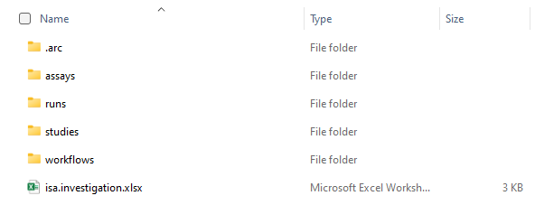
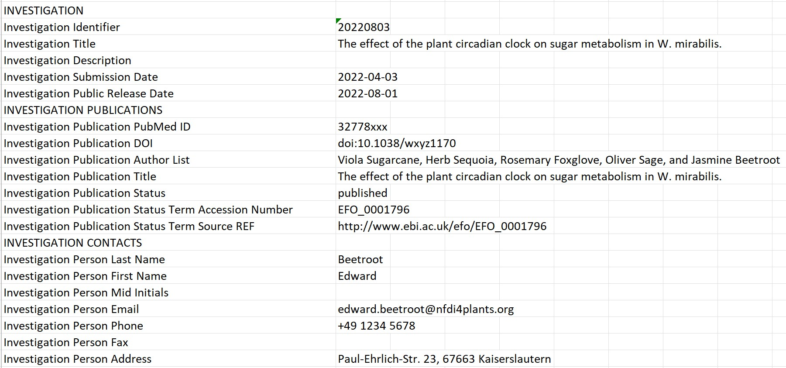

> V1.0
> August 2022

This document is work in progress. If you experience any inconsistencies, have questions or would like to suggest additions, please feel free to <a href="javascript:location='mailto:\u0069\u006e\u0066\u006f\u0040\u006e\u0066\u0064\u0069\u0034\u0070\u006c\u0061\u006e\u0074\u0073\u002e\u006f\u0072\u0067';void 0">contact us</a> or open an issue in our [Helpdesk](<https://helpdesk.nfdi4plants.org>).

We are very happy that you chose our tools and infrastructure to create and share your own ARCs. In this QuickStart we focus on explaining the ARC structure and its different components.

Let's imagine a scenario where a project partner suggests to you at a conference to use this cool new platform called ARC for your collaboration. Convinced by the versioning system and the single-point-of-entry logic, you are motivated to set up your first ARC and fill it with your latest project results when returning to the lab. Back home, however, you only remember the basic ARC structure and something about some isa.xlsx files. So how do you start and get your project into the shown blank ARC, shared by your partner?

To answer this question we will first take look back on Viola's metadata example: 

> Viola investigates the effect of the plant circadian clock on sugar metabolism in *W. mirabilis*. For her PhD project, which is part of an EU-funded consortium in Prof. Beetroot's lab, she acquires seeds from a South-African botanical society. Viola grows the plants under different light regimes, harvests leaves from a two-day time series experiment, extracts polar metabolites as well as RNA and submits the samples to nearby core facilities for metabolomics and transcriptomics measurements, respectively. After a few weeks of iterative consultation with the facilities' heads as well as technicians and computational biologists involved, Viola receives back a wealth of raw and processed data. From the data she produces figures and wraps everything up to publish the results in the *Journal of Wonderful Plant Sciences*.

The entire information given in this example can be stored within an ARC. To illustrate the ARC specifications, we will highlight and explain every (sub)directory and ISA-file of the ARC with references of Viola's example.

## isa.investigation.xlsx
Use the ISA investigation workbook to record administrative metadata of your project. In our example, the title of the project, the contact persons, and related publications correspond to such metadata. Besides that, the workbook can also contain a short description of your project, but also lists included studies with respective design types assays, protocols, etc. Although we recommend to use the ARC Commander for adding these metadata, you can of course fill the workbook (and also the [isa.study.xlsx](#isastudyxlsx) and [isa.assay.xlsx](#isaassayxlsx)) manually.

## Studies
Studies are collections of material and resources used within the investigation. You need to place each study in a unique subdirectory. Material or experimental samples, as well as external data files, can be stored as virtual sample files (containing unique identifiers) in the "resources" directory. To describe the sample or material creation process, protocols can be stored in the designated sub-directory.

### isa.study.xlsx
The ISA study and ISA assay workbooks allow you to annotate your experimental data.
For each study, an isa.study.xlsx file following the ISA study model needs to be present to specify the characteristics of all material and resources, such as a certain strain. Resources might include external data (e.g., knowledge files or result files) that need to be included and cannot be referenced due to external limitations. Resources described in a study file can be the input for one or multiple assays.

## Assays
Assays correspond to outcomes of experimental assays or analytical measurements and are treated as immutable data. Each assay is a collection of files stored in a single directory, including corresponding metadata files. Assay data files, as well as protocols, are placed in a subdirectory individually.

### isa.assay.xlsx
The ISA study and ISA assay workbooks allow you to annotate your experimental data.

Assays correspond to outcomes of experimental assays or analytical measurements and are treated as immutable data. Each assay is a collection of files stored in a single directory, including a mandatory metadata file in ISA-XLSX format.

> Note: An assay must be linked to a study. If a study does not exist, it will be created automatically in this step.

## Workflows
Workflows in ARCs represent processing steps used in computational analyses and other data transformations of studies and assays to generate run results. Typical examples include data cleaning and preprocessing, computational analysis, or visualization.
We highly recommend to include a reproducible execution environment description in form of a Docker container description for tool descriptions.

## Runs
Runs in an ARC represent all artefacts that derive from computations on assay and external data. Plots, tables, or similar results, specific to certain runs need to be saved in a subdirectory of the top-level "runs" directory.

## Cheatsheet
We hope that these examples allow you to produce your own ARCs by now. Use the figure below as a cheatsheet to remember where to store which files.

