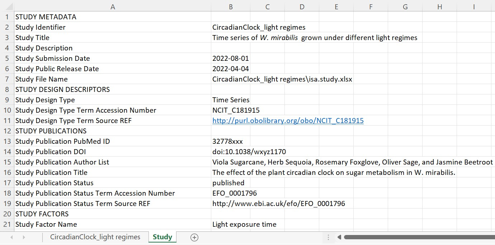

> V1.0
> August 2022

This document is work in progress. If you experience any inconsistencies, have questions or would like to suggest additions, please feel free to <a href="javascript:location='mailto:\u0069\u006e\u0066\u006f\u0040\u006e\u0066\u0064\u0069\u0034\u0070\u006c\u0061\u006e\u0074\u0073\u002e\u006f\u0072\u0067';void 0">contact us</a> or open an issue in our [Helpdesk](<https://helpdesk.nfdi4plants.org>).

We are very happy that you chose our tools and infrastructure to create and share your own ARCs. In this QuickStart we focus on explaining the ARC structure and its different components.

- [Viola's ARC](#violas-arc)
- [isa.investigation.xlsx](#isainvestigationxlsx)
- [Studies](#studies)
  - [isa.study.xlsx](#isastudyxlsx)
- [Assays](#assays)
  - [isa.assay.xlsx](#isaassayxlsx)
- [Workflows](#runs)
- [Runs](#runs)
- [Cheatsheet](#cheatsheet)

## Viola's ARC
Let's imagine a scenario where your project partner suggests at a conference to use this cool new Annotated Research Context (ARC) for your collaboration. Convinced by the versioning system and the single point of entry logic, you are motivated to set up your first own ARC after returning to the lab and fill it with your latest project results. Back home, however, you only remember the basic ARC structure and something about some isa.xlsx files. So how do you transfer your project into the empty ARC your project partner shared with you?

To answer this question, we will first take a look back on Viola's metadata example: 

> Viola investigates the effect of the plant circadian clock on sugar metabolism in *W. mirabilis*. For her PhD project, which is part of an EU-funded consortium in Prof. Beetroot's lab, she acquires seeds from a South-African botanical society. Viola grows the plants under different light regimes, harvests leaves from a two-day time series experiment, extracts polar metabolites as well as RNA and submits the samples to nearby core facilities for metabolomics and transcriptomics measurements, respectively. After a few weeks of iterative consultation with the facilities' heads as well as technicians and computational biologists involved, Viola receives back a wealth of raw and processed data. From the data she produces figures and wraps everything up to publish the results in the *Journal of Wonderful Plant Sciences*.

The entire information given in this example can be stored within an ARC. To illustrate the ARC specifications, we will highlight and explain every (sub)directory and ISA-file of the ARC with references of Viola's example.

## isa.investigation.xlsx
Use the ISA investigation workbook to record administrative metadata of your project. In our example, the title of the project, the contact persons, and related publications correspond to such metadata. Besides that, the workbook can also contain a short description of your project, but also lists included studies with respective design types assays, protocols, etc. Although we recommend to use the ARC Commander for adding these metadata, you can of course fill the workbook (and also the [isa.study.xlsx](#isastudyxlsx) and [isa.assay.xlsx](#isaassayxlsx)) manually.

## Studies
Use the Studies (sub)folders to collect material and resources used within your investigation. Corresponding information in Viola's project are from where she got her seeds, how she grew the plants, and the design of the experiment. 

In case your investigation contains more than one study, each of these studies is placed in an individual subdirectory. Use the "resources" directory to store material samples or external data as virtual sample files. You can use the protocol subdirectory to store free-text protocols describing the sample or material creation process.

### isa.study.xlsx
Every study needs to contain one isa.study.xlsx file to specify the characteristics of all material and resources. Resources described in a study file can be the input for one or multiple assays or workflows. The workbook contains two worksheets:
- "2022_CircadianClock": A worksheet with the name of your study to annotate the inherent properties of your source material following the ISA model. While this can be done manually, we recommend using our ontology supported annotation tool [Swate](QuickStart_swate.html). 
- "Study": Viola collected the administrative metadata of her study in this worksheet. These information can later be transferred into the isa.investigation.xlsx using the ARC Commander.

## Assays
The assays folder allows you to store data and metadata from experimental processes or analytical measurements. Each assay is a collection of files stored in a single directory, including corresponding metadata files in form of an isa.assay.xlsx. Therefore, Viola needs two subdirectories, one for her metabolomics and one for her transcriptomics experiment. Assay data files and free-text protocols are placed in an individual subdirectory. Data files produced by an assay can be the input for one or multiple workflows.

### isa.assay.xlsx
Viola can annotate her experimental workflows of the metabolomics and transcriptomics assays with process parameters in the isa.assay.xlsx file, which needs to be present for every assay. The workbook contains two or more worksheets, depending on the number of used protocols:
- "MetaboliteExtraction": A worksheet with the name of the used protocol to annotate the experimental workflow, in this case for extraction of metabolites. While this can be done manually, we recommend using our ontology supported annotation tool [Swate](QuickStart_swate.html). 
- "MetaboliteMeasurement"
- "Assay": Viola collected the administrative metadata of her assay in this worksheet. These information can later be transferred into the isa.investigation.xlsx using the ARC Commander.

## Workflows
Workflows in ARCs represent processing steps used in computational analyses and other data transformations of studies and assays to generate run results. Typical examples include data cleaning and preprocessing, computational analysis, or visualization. 

Viola received for her transcriptome and metabolome assays various processed data files, which she now can use to generate some nice plots. Additionally, the computational biologists sent her the code used for data processing, including an executable Common Workflow Language (CWL) file, which contains a standardized tool or workflow description. She stored these files in individual subdirectories for each workflow. 

## Runs
After Viola generated her plots, she placed them in individual subdirectories, specific to the run they were generated with. In general, use the runs folder to store plots, tables, or similar result files that derive from computations on assays and external data. 

## Cheatsheet
We hope that these examples nicely illustrated the ARC structure and that you are now ready to produce your own ARCs. Use the figure below as a cheatsheet to remember where to store which files. 

