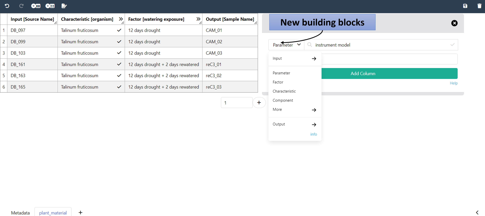

# ARCs come with comprehensive metadata

---

# ARC builds on standards

https://isa-tools.org/ | https://www.commonwl.org/
https://www.researchobject.org/ro-crate/ | https://git-scm.com

---
 
# ARC builds on ISA

ISA Tools: https://isa-tools.org/format/specification.html

---

# ARC builds on ISA to connect data

---

# ARC builds on ISA to link data

  

  - Samples are linked study-to-assay, assay-to-assay
  - Raw data is linked to assays
  - Protocols can be referenced
  - ...

  

  

  
  
  
  

---

# Annotation by flattening the knowledge graph

- Low-friction metadata annotation
- Familiar spreadsheet, row/column-based environment

---

# Annotation principle

- Low-friction metadata annotation
- Familiar spreadsheet, row/column-based environment

---

# Adding new building blocks

Swate can be used for the annotation of **isa.study.xlsx and isa.assay.xlsx** files

---

# Annotation Building Block types

  
  

  
- Input (e.g. Source Name, Sample Name)
- Protocol columns
- Characteristic // Parameter // Factor
- Output (e.g. Sample Name, Raw Data File, Derived Data File)

  
  

  
  
    
  

Let's take a detour on [Annotation Principles](https://nfdi4plants.org/nfdi4plants.knowledgebase/docs/teaching-materials/units/AnnotationPrinciples/isa_AnnotationPrinciples-slides.html)

---

# Ontology term search

Enable **related term directed search** to directly fill cells with child terms

---

# Fill your table with ontology terms

---

# Hierarchical combination of ontologies

---

# Checklists and Templates

Metadata standards or repository requirements can be represented as templates

---

# Realization of lab-specific metadata templates

Facilities can define their most common workflows as templates

---

# Directly import templates via Swate

- DataPLANT curated
- Community templates

